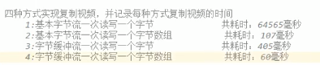
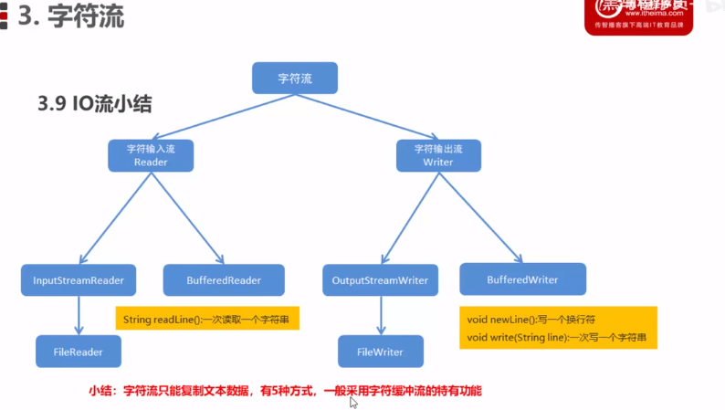

# File类使用

Java文件类以抽象的方式代表文件名和目录路径名。该类主要用于文件和目录的创建、文件的查找和文件的删除等。

File对象代表磁盘中实际存在的文件和目录。通过以下构造方法创建一个File对象。

通过给定的父抽象路径名和子路径名字符串创建一个新的File实例。

```
File(File parent, String child);
```

通过将给定路径名字符串转换成抽象路径名来创建一个新 File 实例。

```
File(String pathname)
```

根据 parent 路径名字符串和 child 路径名字符串创建一个新 File 实例。

```
File(String parent, String child)
```

通过将给定的 file: URI 转换成一个抽象路径名来创建一个新的 File 实例。

```
File(URI uri)
```

| 方法描述 |                                                              |
| :------: | ------------------------------------------------------------ |
|    1     | **public String getName()** 返回由此抽象路径名表示的文件或目录的名称。 |
|    2     | **public String getParent()** 返回此抽象路径名的父路径名的路径名字符串，如果此路径名没有指定父目录，则返回 `null`。 |
|    3     | **public File getParentFile()** 返回此抽象路径名的父路径名的抽象路径名，如果此路径名没有指定父目录，则返回 `null`。 |
|    4     | **public String getPath()** 将此抽象路径名转换为一个路径名字符串。 |
|    5     | **public boolean isAbsolute()** 测试此抽象路径名是否为绝对路径名。 |
|    6     | **public String getAbsolutePath()** 返回抽象路径名的绝对路径名字符串。 |
|    7     | **public boolean canRead()** 测试应用程序是否可以读取此抽象路径名表示的文件。 |
|    8     | **public boolean canWrite()** 测试应用程序是否可以修改此抽象路径名表示的文件。 |
|    9     | **public boolean exists()** 测试此抽象路径名表示的文件或目录是否存在。 |
|    10    | **public boolean isDirectory()** 测试此抽象路径名表示的文件是否是一个目录。 |
|    11    | **public boolean isFile()** 测试此抽象路径名表示的文件是否是一个标准文件。 |
|    12    | **public long lastModified()** 返回此抽象路径名表示的文件最后一次被修改的时间。 |
|    13    | **public long length()** 返回由此抽象路径名表示的文件的长度。 |
|    14    | **public boolean createNewFile() throws IOException** 当且仅当不存在具有此抽象路径名指定的名称的文件时，原子地创建由此抽象路径名指定的一个新的空文件。 |
|    15    | **public boolean delete()** 删除此抽象路径名表示的文件或目录。 |
|    16    | **public void deleteOnExit()** 在虚拟机终止时，请求删除此抽象路径名表示的文件或目录。 |
|    17    | **public String[] list()** 返回由此抽象路径名所表示的目录中的文件和目录的名称所组成字符串数组。 |
|    18    | **public String[] list(FilenameFilter filter)** 返回由包含在目录中的文件和目录的名称所组成的字符串数组，这一目录是通过满足指定过滤器的抽象路径名来表示的。 |
|    19    | **public File[] listFiles()** 返回一个抽象路径名数组，这些路径名表示此抽象路径名所表示目录中的文件。 |
|    20    | **public File[] listFiles(FileFilter filter)** 返回表示此抽象路径名所表示目录中的文件和目录的抽象路径名数组，这些路径名满足特定过滤器。 |
|    21    | **public boolean mkdir()** 创建此抽象路径名指定的目录。      |
|    22    | **public boolean mkdirs()** 创建此抽象路径名指定的目录，包括创建必需但不存在的父目录。 |
|    23    | **public boolean renameTo(File dest)** 重新命名此抽象路径名表示的文件。 |
|    24    | **public boolean setLastModified(long time)** 设置由此抽象路径名所指定的文件或目录的最后一次修改时间。 |
|    25    | **public boolean setReadOnly()** 标记此抽象路径名指定的文件或目录，以便只可对其进行读操作。 |
|    26    | **public static File createTempFile(String prefix, String suffix, File directory) throws IOException** 在指定目录中创建一个新的空文件，使用给定的前缀和后缀字符串生成其名称。 |
|    27    | **public static File createTempFile(String prefix, String suffix) throws IOException** 在默认临时文件目录中创建一个空文件，使用给定前缀和后缀生成其名称。 |
|    28    | **public int compareTo(File pathname)** 按字母顺序比较两个抽象路径名。 |
|    29    | **public int compareTo(Object o)** 按字母顺序比较抽象路径名与给定对象。 |
|    30    | **public boolean equals(Object obj)** 测试此抽象路径名与给定对象是否相等。 |
|    31    | **public String toString()** 返回此抽象路径名的路径名字符串。 |

# FileReader（读文件）

FileReader类从InputStreamReader类继承而来。该类按字符读取流中数据。可以通过以下几种构造方法创建需要的对象。

在给定从中读取数据的 File 的情况下创建一个新 FileReader。

```
FileReader(File file)
```

在给定从中读取数据的 FileDescriptor 的情况下创建一个新 FileReader。

```
FileReader(FileDescriptor fd)
```

在给定从中读取数据的文件名的情况下创建一个新 FileReader。

```
FileReader(String fileName)
```

创建FIleReader对象成功后，可以参照以下列表里的方法操作文件。

| 序号 | 文件描述                                                     |
| :--: | :----------------------------------------------------------- |
|  1   | **public int read() throws IOException** 读取单个字符，返回一个int型变量代表读取到的字符 |
|  2   | **public int read(char [] c, int offset, int len)** 读取字符到c数组，返回读取到字符的个数 |

```java
FileReader f3 = new FileReader("java1.txt");
char[] a = new char[10];
f3.read(a); // read()返回值为int，不知道代表啥，保存需要使用char[]
for(char c:a) {
    System.out.println(c);
}
```


# Java FileWriter类（写入方法）

FileWriter 类从 OutputStreamWriter 类继承而来。该类按字符向流中写入数据。可以通过以下几种构造方法创建需要的对象。

在给出 File 对象的情况下构造一个 FileWriter 对象。

```java
FileWriter(File file)
```

在给出 File 对象的情况下构造一个 FileWriter 对象。

```java
FileWriter(File file, boolean append)
```

**参数：**

- **file**：要写入数据的 File 对象。
- **append**：如果 append 参数为 true，则将字节写入文件末尾处，相当于追加信息。如果 append 参数为 false, 则写入文件开始处。
- - 构造与某个文件描述符相关联的 FileWriter 对象。

```java
FileWriter(FileDescriptor fd)
```

在给出文件名的情况下构造 FileWriter 对象，它具有指示是否挂起写入数据的 boolean 值。（**可以添加的格式）**

```java
FileWriter(String fileName, boolean append)
```

创建FileWriter对象成功后，可以参照以下列表里的方法操作文件。

| 序号 | 方法描述                                                     |
| :--: | :----------------------------------------------------------- |
|  1   | **public void write(int c) throws IOException** 写入单个字符c。 |
|  2   | **public void write(char [] c, int offset, int len)** 写入字符数组中开始为offset长度为len的某一部分。 |
|  3   | **public void write(String s, int offset, int len)** 写入字符串中开始为offset长度为len的某一部分。 |

```java
FileWriter f2 = new FileWriter("java1.txt"); // 没有则会自动创建
f2.write("dasfds");
f2.close();
```







## FileInputStream

该流用于从文件读取数据，它的对象可以用关键字 new 来创建。

有多种构造方法可用来创建对象。

可以使用字符串类型的文件名来创建一个输入流对象来读取文件：

```java
InputStream f = new FileInputStream("C:/java/hello");
```

也可以使用一个文件对象来创建一个输入流对象来读取文件。我们首先得使用 File() 方法来创建一个文件对象：

```java
File f = new File("C:/java/hello");
InputStream out = new FileInputStream(f);
```

## FileOutputStream

该类用来创建一个文件并向文件中写数据。

如果该流在打开文件进行输出前，目标文件不存在，那么该流会创建该文件。

有两个构造方法可以用来创建 FileOutputStream 对象。

使用字符串类型的文件名来创建一个输出流对象：

```java
OutputStream f = new FileOutputStream("C:/java/hello")
```

## 字节流(BufferedInputStream/BufferedOutputStream)

二进制

```java
BufferedInputStream fis = new BufferedInputStream(new
                                                  FileInputStream("bos1.txt"));
BufferedOutputStream bis = new BufferedOutputStream(new
                                                    FileOutputStream("bos2.txt"));

 byte[] bys = new byte[1024];
int len;
while((len=fis.read(bys))!=-1) {
    bis.write(bys,0,len);
}  
```

## 字符流(OutputStreamWriter/InputStreamReader)

二进制+编码

- write()，写数据
- flush() 刷新，可以继续写
- close()，关闭
- read()，读一个
- read(char[] s) ，读一串

```java
//默认UTF-8
//File f = new File("osw.txt");
OutputStreamWriter osw = new OutputStreamWriter(new FileOutputStream("osw.txt"),"UTF-8");

osw.write("哈哈哈");
osw.close();
//FileInputStream fip = new FileInputStream(f);
//InputStreamReader reader = new InputStreamReader(fip, "UTF-8");
InputStreamReader reader = new InputStreamReader(new FileInputStream("input.txt"), "UTF-8");
char[] chs = new char[1024];
int len1;
while((len1 = isr.read(chs)) != -1) { // 一行一行读
    System.out.print(new String(chs, 0, len1)); // 批量读取数据
    osw.write(chs, 0, len1); // 将读入的复制到osw中
}
reader.close();
```

## 字符缓冲流(BufferedWriter/BufferedReader)

- newLine()：写一行行分隔符
- readLine()：读一行不包括终结符，若没有则返回null

```java
BufferedWriter bfw = new BufferedWriter(new FileWriter("bos1.txt"));
bfw.write("哈哈");
bfw.newLine();
bfw.flush(); // 将缓冲刷新到文件中去
bfw.close();

BufferedReader bfr = new BufferedReader(new FileReader("bos2.txt"));
// 一次读一个字符
int ch;
while((ch=bfr.read()) != -1) {
    System.out.print((char)ch);
}
// 一次读一个字符数组
char[] chs = new char[1024];
int len;
while((len=bfr.read(chs)) != -1) {
    System.out.print(new String(chs, 0, len));
    bfw.write(chs, 0, len); // 复制文件方法一
}


String line;
while((line=bfr.readLine()) != null) { //复制文件方法二
    bfw.write(line);
}
```


## 创建文件

```java
import java.io.File;
String dirname = "/tmp/user/java/bin";
File d = new File(dirname);
// 现在创建目录
d.mkdirs();
```

**注意：** Java 在 UNIX 和 Windows 自动按约定分辨文件路径分隔符。如果你在 Windows 版本的 Java 中使用分隔符 (/) ，路径依然能够被正确解析。

## 读取文件

一个目录其实就是一个 File 对象，它包含其他文件和文件夹。

使用 list() 方法来检查一个文件夹中包含的内容

```java
String dirname = "/tmp";
File f1 = new File(dirname);
if (f1.isDirectory()) {
    System.out.println("目录 " + dirname);
    String s[] = f1.list();
    for (int i = 0; i < s.length; i++) {
        File f = new File(dirname + "/" + s[i]);
        if (f.isDirectory()) {
            System.out.println(s[i] + " 是一个目录");
        } else {
            System.out.println(s[i] + " 是一个文件");
        }
    }
} else {
    System.out.println(dirname + " 不是一个目录");
}
```

## 删除目录或文件

删除文件可以使用 **java.io.File.delete()** 方法。

```java
/*
/tmp/java/
|-- 1.log
|-- test
 */  
import java.io.File;
 
public class DeleteFileDemo {
    public static void main(String args[]) {
        // 这里修改为自己的测试目录
        File folder = new File("/tmp/java/");
        deleteFolder(folder);
    }
 
    // 删除文件及目录
    public static void deleteFolder(File folder) {
        File[] files = folder.listFiles();
        if (files != null) {
            for (File f : files) {
                if (f.isDirectory()) {
                    deleteFolder(f);
                } else {
                    f.delete();
                }
            }
        }
        folder.delete();
    }
}
```

