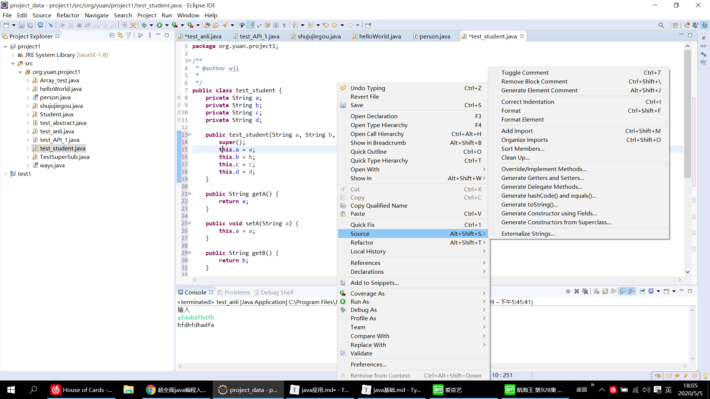

# debug

在Javaweb项目中的应用,一般在我们进行调试的时候,会把断点打在web项目的action或controller对应请求的第一行代码上,这样做的好处是前台请求进入后台后第一时间或被断点拦截

断点运行控制按钮进行控制,一般使用**F6**一步一步在方法体中运行

### 字符翻转

```java
	private String reverseString(String line) {
		// 字符翻转
		// TODO Auto-generated method stub
//		String ss = "";
//		for(int i=line.length()-1;i>=0;i--) {
//			ss += line.charAt(i);
//		}
//		System.out.println("输出:"+ss);
		return new StringBuilder(line).reverse().toString();
	}
	
```

### 集合使用

```java
ArrayList<String> array = new ArrayList<String>(); // 可以指定类型/自定义类 <>
// add(值)添加。 remove(index)删除, set(index, element) 替换, get（index）查找
```

# IDLE使用

## debug

在Javaweb项目中的应用,一般在我们进行调试的时候,会把断点打在web项目的action或controller对应请求的第一行代码上,这样做的好处是前台请求进入后台后第一时间或被断点拦截

断点运行控制按钮进行控制,一般使用**F6**一步一步在方法体中运行

## 类 自动生成常用方法

右键->source->



- 定义好**类变量**后，利用constructor using Fields，可以自动生成构造器

- 利用Getter and Setters可以自动生成改变和获取类变量的方法

# 多态使用

接口多态和抽象类多态

```java
abstract public class Animals {
	abstract public void eat(); // 方法添加抽象，类必须实现这个方法
}
```

```java
public interface Jump1 {
// 	abstract public void jump();
    public void fly(); 
	public abstract void jump(); // 添加抽象，类必须实现这个方法
}
```

```java
public class Dogs extends Animals implements Jump1 {
    public void eat() {
        
	}
	public void jump() {
		System.out.println("撒发射点");
	}
}
```

```java
public class test_main {
	public static void main(String[] args) {
		Jump1 j1 = new Dogs();
		j1.jump();
        // j1.eat(); 报错，接口中没有这个方法
		Animals a1 = new Dogs();
		a1.eat();
        // a1.jump();  报错，因为抽象类中没有这个方法
	}
}
```

## 接口内部

- 变量只能是final,static常量

- 方法只能是抽象的

## 接口与抽象类区别

- 尽量将，公有的放到抽象类，特殊的方法放入接口
- 抽象类是对事物的抽象，而接口是对行为的抽象

# 内部类使用

```java
public class Dogs extends Animals implements Jump1 {
	public class jinba {
		public void eat() {
			// TODO Auto-generated method stub
			System.out.println("京巴");
		}
	}
}

// 创建内部类实例，私有内部类可以通过外部类方法使用
Dogs.jinba jb1 = new Dogs().new jinba(); 
```

## 局部内部类

```java
public void eat() {
		// TODO Auto-generated method stub
		class A{

		}
		
	}
//方法内调用
```

##### 匿名内部类

本质是一个继承了该类或是实现了该接口的子类匿名对象，可以重写类/接口的方法

```java
public interface Jump1 {
 	abstract public void fly();

	abstract public void jump();
}
public class Dogs extends Animals implements Jump1 {
	
    public void eat() {
            // TODO Auto-generated method stub
        	// 匿名内部类，可以用作重写方法
            Jump1 a = new Jump1() {
                @Override
                public void jump() {
                    // TODO Auto-generated method stub
                }
                @Override
                public void fly() {
                    // TODO Auto-generated method stub
                }
            };
        }
}

```

可以用作声明简要的类，不用搞那么多新类了。

