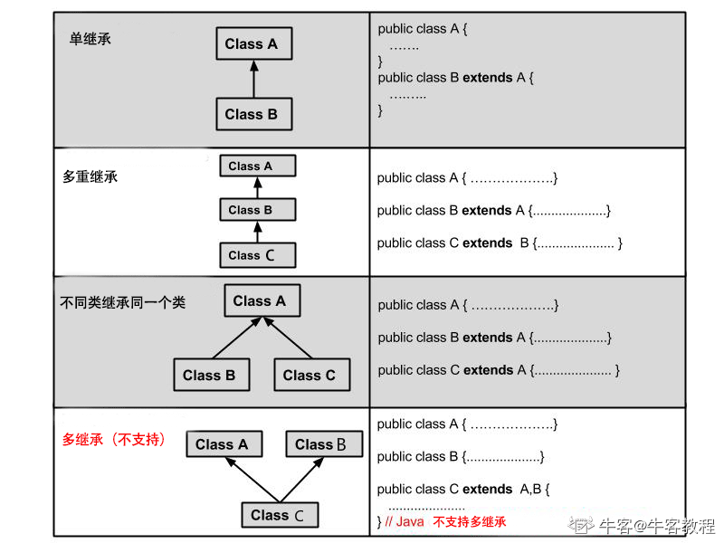
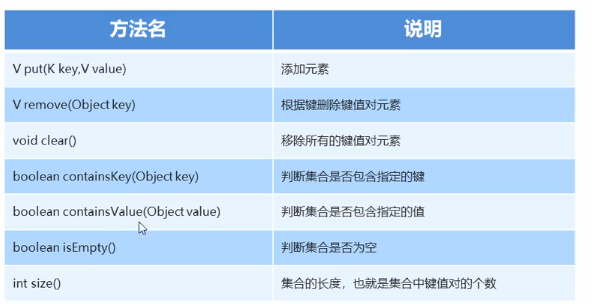
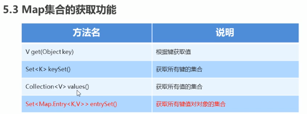
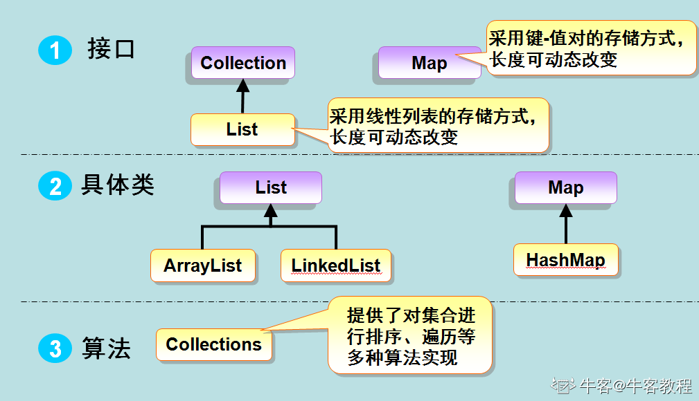
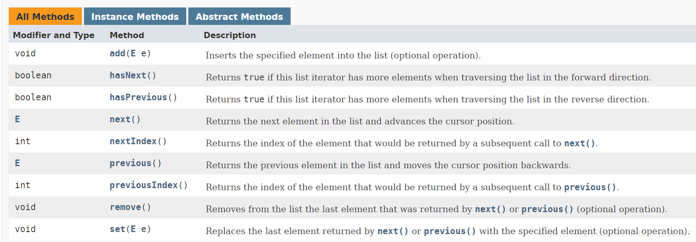
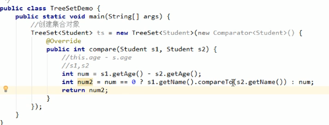

[TOC]

[Eclipse简明使用教程(java集成开发环境）](https://blog.csdn.net/qq_36243942/article/details/81607906#2.Eclipse%E5%88%9B%E5%BB%BAJava%E6%96%87%E4%BB%B6)
[牛客JAVA教程](https://www.nowcoder.com/tutorial/10001/5fc0c07cd9d44e66b3baafd76f1f5b9f)

# 基本数据类型

## 内置数据类型

| 符号   | btyte        | short             | int                       | long                                  | float | double | char    | boolean | String |
| ------ | ------------ | ----------------- | ------------------------- | ------------------------------------- | ----- | ------ | ------- | ------- | ------ |
| 位数   | 8位          | 16位              | 32位                      | 64位                                  | 32位  | 64位   | 16位    | 1位     | 字符串 |
| 最小值 | $-128(-2^7)$ | $-32768(-2^{15})$ | $-2,147,483,648(-2^{31})$ | $-9,223,372,036,854,775,808(-2^{63})$ |       |        | \u0000  | true    |        |
| 最大值 | $2^7-1$      | $2^{15}-1$        | $2^{31}-1$                | $2^{63}-1$                            |       |        | \uffff  | false   |        |
| 默认值 | 0            | 0                 | 0                         | 0L                                    | 0.0f  | 0.0d   | 'u0000' | false   |        |

## 应用数据类型

数组，对象的引用，就是引用数据类型(类似于C指针)

## Java常量

final 关键字修饰常量，不能修改

```java
final double PI = 3.14
```

## 定义变量

""双引号是字符串，''单引号是字符

```java
a = "sdag";
b = 'd';
c = 0x6A; //十六进制
d = 0144; //八进制
```

- 'a'-'z': 97-122
- 'A'-'Z':65-90

### 变量类型

1. 类变量：独立于方法之外的变量，用 static 修饰。

- 静态变量除了被声明为常量外很少使用。常量是指声明为public/private，final和static类型的变量。常量初始化后不可改变。
- 静态变量可以通过：ClassName.VariableName的方式访问。
- 类变量被声明为public static final类型时，类变量名称一般建议使用大写字母。如果静态变量不是public和final类型，其命名方式与实例变量以及局部变量的命名方式一致。
- 类变量也称为静态变量，在类中以 static 关键字声明，但必须在方法之外。

```java
public class Employee {
 
    //salary是静态的私有变量
    private static double salary;
    // DEPARTMENT是一个常量
    public static final String DEPARTMENT = "高中部";
 
    public static void main(String[] args){
           salary = 10000;
        System.out.println(DEPARTMENT+"平均工资:"+salary);
    }
}
```

2. 实例变量：独立于方法之外的变量，不过没有 static 修饰。

- 限制在类内，一般为私有，可以使用修饰符修改变量；
- 访问修饰符可以修饰实例变量；
- 类内方法、构造方法、语句块均可使用；
- 子类可以使用修饰符，使实例变量可见
- 可以有默认值
- 实例变量可以直接通过变量名访问。但在静态方法以及其他类中，就应该使用完全限定名：ObejectReference.VariableName。

```java
public class helloWorld {
	
	private double salary=1;
	
	public void get_salary() {
		System.out.println(salary);
	}
	
	public static void main(String[] args) {
	 	helloWorld emp = new helloWorld(); // 定义实例
	 	System.out.println(emp.salary);  // 在实例中直接实例变量
	 	emp.get_salary(); //或使用实例中的方法调用
	}
}

```

3. 局部变量：类的方法中的变量。

- 局部变量没有默认值，必须指定；
- 限制在方法内；

# 运算符

## 逻辑运算符

| &    | \|   | !    | ^    |
| ---- | ---- | ---- | ---- |
| 与   | 或   | 非   | 异或 |

## 短路逻辑运算符（常用）

| &&     | \|\|   |
| ------ | ------ |
| 短路与 | 短路或 |

前头短路的情况下，后头不运行

## 三元运算符

关系表达式?表达式1:表达式2
`c = a>b?a:b //获取数据中较大值
`

# 数据输入/输出

```java
import java.util.Scanner
Scanner s = new Scanner(System.in);
// 判断是否还有输入
if (scan.hasNext()) {
    // next接收
    String str1 = scan.next();
    System.out.println("输入的数据为：" + str1);
}
if (scan.hasNextLine()) {
    String str2 = scan.nextLine();
    System.out.println("输入的数据为：" + str2);
}
```

## next() 与 nextLine() 区别

next():

- 1、一定要读取到有效字符后才可以结束输入。
- 2、对输入有效字符之前遇到的空白，next() 方法会自动将其去掉。
- 3、只有输入有效字符后才将其后面输入的空白作为分隔符或者结束符。
- **next() 不能得到带有空格的字符串。**

nextLine()：

- 1、以**Enter为结束符**,也就是说 nextLine()方法返回的是输入回车之前的所有字符。
- 2、**可以获得空白。**

##  int / float 

- hasNextFloat() nextFloat()

- hasNextInt() nextInt()

- hasNextDouble(), nextDouble()

- ```java
  while (scan.hasNextDouble()) //循环输入
  ```

```java
import java.util.Scanner;
public class ScannerDemo {
    public static void main(String[] args) {
        Scanner scan = new Scanner(System.in);
        // 从键盘接收数据
        int i = 0;
        float f = 0.0f;
        System.out.print("输入整数：");
        if (scan.hasNextInt()) {
            // 判断输入的是否是整数
            i = scan.nextInt();
            // 接收整数
            System.out.println("整数数据：" + i);
        } else {
            // 输入错误的信息
            System.out.println("输入的不是整数！");
        }
        System.out.print("输入小数：");
        if (scan.hasNextFloat()) {
            // 判断输入的是否是小数
            f = scan.nextFloat();
            // 接收小数
            System.out.println("小数数据：" + f);
        } else {
            // 输入错误的信息
            System.out.println("输入的不是小数！");
        }
        scan.close();
    }
}
```

# 条件判断

## if else

```java
if(){
	语句;
}else if(){
	语句;
}else{
	语句;
}
```

## switch case

1. 如果当前匹配成功的 case 语句块**没有 break** 语句，则从当前 case 开始，**后续所有 case** 的值都会输出，如果后续的 case 语句块有 break 语句则会跳出判断。

2. default 相当于 if 中的else

```java
switch(){
	case 值1:
			语句;
			break;
	case 值2:
			语句;
			break;
    default :
        语句;
}
```

# 循环结构

## while

## do..while

```java
do{
    //代码语句
} while(布尔表达式);
```

## for

```java
for(i=0; i<10; i++){
    //代码语句
}
```

### 加强for

增强的for循环是没有下标的，一般用于不需要下标时的操作，如查询

```java
for(声明语句 : 表达式) {
   //代码句子
}
```

- **声明语句：**声明新的局部变量，该变量的类型必须和数组元素的类型匹配。其作用域限定在循环语句块，其值与此时数组元素的值相等。

- **表达式：**表达式是要访问的数组名，或者是返回值为数组的方法。

eg:

```java
public class Test {
   public static void main(String args[]){
      int [] numbers = {10, 20, 30, 40, 50};
 
      for(int x : numbers ){
         System.out.print( x );
         System.out.print(",");
      }
      System.out.print("\n");
      String [] names ={"James", "Larry", "Tom", "Lacy"};
      for( String name : names ) {
         System.out.print( name );
         System.out.print(",");
      }
   }
}
```

得到

```java
10,20,30,40,50,
James,Larry,Tom,Lacy,
```


# 修饰符

| 修饰符    | 介绍                             | 使用对象                                | 当前类 | 同一包内 | 子孙类(同一包) | 子孙类(不同包) | 其他包 |      |
| --------- | -------------------------------- | --------------------------------------- | ------ | -------- | -------------- | -------------- | ------ | ---- |
| public    | 在同一包内可见，不使用任何修饰符 | 使用对象：类、接口、变量、方法。        | Y      | Y        | Y              | Y              | Y      |      |
| protected | 在同一类内可见                   | 变量、方法。 注意：不能修饰类（外部类） | Y      | Y        | Y              | Y/N            | N      |      |
| default   | 对所有类可见                     | 类、接口、变量、方法                    | Y      | Y        | Y              | N              | N      | N    |
| private   | 对同一包内的类和所有子类可见     | 变量、方法。 注意：不能修饰类（外部类） | Y      | N        | N              | N              | N      |      |

## 访问修饰符

### 默认修饰符

defalut

### 私有访问修饰符-private

- 声明为私有访问类型的变量只能通过类中公共的 getter 方法被外部类访问。
- 不能直接访问，必须通过调用类内的方法才能访问

### 公有访问修饰符-public

- 由于类的继承性，类所有的公有方法和变量都能被其子类继承。

### 受保护的访问修饰符-protected

- 保护层次在包内。类内和public一样，类外必须继承才能访问（导入不行）。

- **子类与基类在同一包中**：被声明为 protected 的变量、方法和构造器能被同一个包中的任何其他类访问；
- **子类与基类不在同一包中**：那么在子类中，子类实例可以访问其从基类继承而来的 protected 方法，而不能访问基类实例的protected方法。

protected 可以修饰数据成员，构造方法，方法成员，**不能修饰类（内部类除外）**。

### 访问控制和继承

请注意以下方法继承的规则：

- 父类中声明为 public 的方法在子类中也必须为 public。
- 父类中声明为 protected 的方法在子类中要么声明为 protected，要么声明为 public，不能声明为 private。
- 父类中声明为 private 的方法，不能够被继承。

## 非访问修饰符

static ，用来修饰**类方法和类变量**。

final ，用来修饰**类、方法和变量**，final 修饰的类**不能够被继承**，修饰的方法不能被继承类重新定义，修饰的变量为常量，是**不可修改**的。

- final 修饰符通常和 static 修饰符一起使用来创建类常量。

abstract ，用来创建**抽象类和抽象方法**。

- 抽象类不能用来实例化对象，声明抽象类的唯一目的是为了将来对该类进行扩充。
- 如果一个类包含抽象方法，那么该类一定要声明为抽象类，否则将出现编译错误。
- 抽象类可以包含抽象方法和非抽象方法。
- 抽象方法是一种没有任何实现的方法，该方法的的具体实现由子类提供。
- 任何继承抽象类的子类必须实现父类的所有抽象方法，除非该子类也是抽象类。
- 抽象方法的声明以分号结尾，例如：**public abstract sample();**。

synchronized 和 volatile ，主要用于线程的编程。

- synchronized 关键字声明的方法同一时间只能被一个线程访问。synchronized 修饰符可以应用于四个访问修饰符
- volatile 修饰的成员变量在每次被线程访问时，都强制从共享内存中重新读取该成员变量的值。而且，当成员变量发生变化时，会强制线程将变化值回写到共享内存。这样在任何时刻，两个不同的线程总是看到某个成员变量的同一个值。一个 volatile 对象引用可能是 null。

transient,序列化的对象包含被 transient 修饰的实例变量时，java 虚拟机(JVM)跳过该特定的变量。

- 该修饰符包含在定义变量的语句中，用来预处理类和变量的数据类型。

```java
public transient int limit = 55;   // 不会持久化
public int b; // 持久化
```

# 运算符

## instanceof 运算符

- 该运算符用于操作对象实例，检查该对象是否是一个特定类型（类类型或接口类型）。

instanceof运算符使用格式如下：

```java
a instanceof A; //判断a是否为A的一个实例
( Object reference variable ) instanceof (class/interface type)
```

如果运算符左侧变量所指的对象，是操作符右侧类或接口(class/interface)的一个对象，那么结果为真。

```java
String name = "James";
boolean result = name instanceof String;// 由于 name 是 String 类型，所以返回真
```

如果被比较的对象兼容于右侧类型,该运算符仍然返回true。

```java
class Vehicle {}
public class Car extend Vehicle{
    public static void main(Sring[] args){
        Vehicle a = new Car();
        boolean result = a instanceof Car;
        System.out.println(result);
    }
}
```

以上实例编译运行结果如下：

```
true
```

## Java运算符优先级

| 高     |   类别   |                   操作符                   |  关联性  |
| ------ | :------: | :----------------------------------------: | :------: |
|        |   后缀   |             () [] . (点操作符)             |  左到右  |
|        |   一元   |                 + + - ！〜                 | 从右到左 |
|        |   乘性   |                   * /％                    |  左到右  |
|        |   加性   |                    + -                     |  左到右  |
|        |   移位   |                 >> >>> <<                  |  左到右  |
|        |   关系   |                 >> = << =                  |  左到右  |
|        |   相等   |                   == !=                    |  左到右  |
|        |  按位与  |                     ＆                     |  左到右  |
|        | 按位异或 |                     ^                      |  左到右  |
|        |  按位或  |                     \|                     |  左到右  |
|        |  逻辑与  |                     &&                     |  左到右  |
|        |  逻辑或  |                   \| \|                    |  左到右  |
|        |   条件   |                    ？：                    | 从右到左 |
|        |   赋值   | = + = - = * = / =％= >> = << =＆= ^ = \| = | 从右到左 |
| **低** |   逗号   |                     ，                     |  左到右  |

# 数组

## 声明、初始化、使用、for-each

```java
dataType[] arrayRefVar;   // 首选的方法
dataType arrayRefVar[];  // 效果相同，但不是首选方法，c/c++的默认方法
double[] myList;         // 首选的方法
double myList[];         //  效果相同，但不是首选方法
double[] myList = {1.9, 2.9, 3.4, 3.5};
// myList.length 长度
// 打印所有数组元素
for (int i = 0; i < myList.length; i++) {
         System.out.println(myList[i] + " ");
      }
for (double element: myList) {
         System.out.println(element);
      }
```

## 多维数组

```java
//直接为每一维分配空间，格式如下：
String str[][] = new String[3][4];
//type[][] typeName = new type[typeLength1][typeLength2];
//从最高维开始，分别为每一维分配空间，例如：
String s[][] = new String[2][];
s[0] = new String[2];
s[1] = new String[3];
```

## Arrays 类（排序，插入，比较，查找）

- java.util.Arrays 类能方便地操作数组，它提供的所有方法都是静态的。

- 给数组赋值：通过 fill 方法。

```java
Arrays.fill(int[] a,int val) ;
Arrays.fill(int[] a,int fromIndex,int toIndex,int val); //用val值来填充数组a中所指定的范围
int[] a = new int[10];
Arrays.fill(a,1,9,10);
```

- 对数组排序：通过 sort 方法,按升序。

```java
import java.util.Arrays;
import java.util.Collections;
int[] a ={1,2,3,5};
Arrays.sort(a); //对数组a进行升序排序
//降序
//注意，要想改变默认的排列顺序，不能使用基本类型（int,double, char）,而要使用它们对应的类
Integer[] arr = {9, 8, 7, 2, 3, 4, 1, 0, 6, 5};
Arrays.sort(arr, Collections.reverseOrder());
```

```java
// 或是自己指定，降序方法
import java.util.Arrays;
public class Main {
    public static void main(String[] args) {
        //注意，要想改变默认的排列顺序，不能使用基本类型（int,double, char）,而要使用它们对应的类
        Integer[] arr = {9, 8, 7, 2, 3, 4, 1, 0, 6, 5};
        //定义一个自定义类MyComparator的对象
        Comparator cmp = new MyComparator();
        Arrays.sort(arr, cmp);
        for (int x : arr) {
            System.out.print(x + " ");
        }
    }
}
//实现Comparator接口
class MyComparator implements Comparator<Integer> {
    @Override //作用是检查下面的方法名是不是父类中所有的，也起到注释的作用
    public int compare(Integer a, Integer b) {
        return a > b ? -1 : 1;
    }
}
```

- 比较数组：通过 equals 方法比较数组中元素值是否相等。

```java
Ayyays.equals(int[] a, int aFromIndex, int aToIndex, int[] b, int bFromIndex, int bToIndex);//可以指定比较范围
Arrays.equals(a,1,10,b,2,11); //比较a中1~10和b中2~11是否相同
```

- 查找数组元素：通过 binarySearch 方法能对**排序好的数组**进行二分查找法操作。

```java
int[] a = {1,2,3,4,5};
Arrays.binarySearch(a,5);
```

# 方法

## 命名规则

- 方法的名字的第一个单词应以小写字母作为开头，后面的单词则用大写字母开头写，不使用连接符。例如：**addPerson**。
- 下划线可能出现在 JUnit 测试方法名称中用以分隔名称的逻辑组件。一个典型的模式是：`test_`，例如 `testPop_emptyStack`。

## 方法的定义

```java
修饰符 返回值类型 方法名(参数类型 参数名){
    ...
    方法体
    ...
    return 返回值;
}
```

## 方法重载

如果你调用max方法时传递的是int型参数，则 int型参数的max方法就会被调用；

如果传递的是double型参数，则double类型的max方法体会被调用，这叫做方法重载；

就是说一个类的两个方法拥有相同的名字，但是有不同的参数列表。

Java编译器根据方法签名判断哪个方法应该被调用。

方法重载可以让程序更清晰易读。执行密切相关任务的方法应该使用相同的名字。

重载的方法必须**拥有不同的参数列表**。你不能仅仅依据修饰符或者返回类型的不同来重载方法。

```java
public static double max(double num1, double num2) {
  if (num1 > num2)
    return num1;
  else
    return num2;
}
public static int max(int num1, int num2) {
    int result;
    if (num1 > num2)
        result = num1;
    else
        result = num2;

    return result;
}
```

## 构造方法

（与python中\_\_init\_\_方法相似）

构造方法和它所在类的名字相同，但构造方法没有返回值。构造方法类型也与类相同。

通常会使用构造方法给一个类的实例变量赋初值，或者执行其它必要的步骤来创建一个完整的对象。

```java
// 一个简单的构造函数
class MyClass {
  int x;
 
  // 以下是构造函数
  MyClass() {
    x = 10;
  }
}
```

## 可变参数

JDK 1.5 开始，Java支持传递同类型的可变参数给一个方法。

在方法声明中，在指定参数类型后加一个省略号(...) 。

一个方法中只能指定一个可变参数，它必须是方法的最后一个参数。任何普通的参数必须在它之前声明。

传进去之后成为数组，再运算

```java
//typeName... parameterName
public class VarargsDemo {
    public static void main(String args[]) {
        // 调用可变参数的方法
        printMax(34, 3, 3, 2, 56.5);
        printMax(new double[]{1, 2, 3});
    }
    public static void printMax( double... numbers) {
        double result = numbers[0];
        for (int i = 1; i <  numbers.length; i++){
            if (numbers[i] >  result) {
                result = numbers[i];
            }
        }
        System.out.println("The max value is " + result);
    }
}
```

## finalize() 方法(垃圾回收方法)

Java 允许定义这样的方法，它在对象被垃圾收集器析构(回收)之前调用，这个方法叫做 finalize( )，它用来清除回收对象。

在 finalize() 方法里，你必须指定在对象销毁时候要执行的操作。

```java
protected void finalize() {
   // 在这里终结代码
}
//关键字 protected 是一个限定符，它确保 finalize() 方法不会被该类以外的代码调用。
```

```java
public class FinalizationDemo { 
  public static void main(String[] args) { 
    Cake c1 = new Cake(1); 
    Cake c2 = new Cake(2); 
    Cake c3 = new Cake(3); 
 
    c2 = c3 = null; 
    System.gc(); //调用Java垃圾收集器，会把没用的回收，eg:null,[]
  } 
} 
 
class Cake extends Object { 
  private int id; 
  public Cake(int id) {  //构造
    this.id = id; 
    System.out.println("Cake Object " + id + "is created"); 
  } 
 
  protected void finalize() throws java.lang.Throwable {  //析构（回收）
    super.finalize(); 
    System.out.println("Cake Object " + id + "is disposed"); 
  } 
}
/*
$ javac FinalizationDemo.java
$ java FinalizationDemo
Cake Object 1is created
Cake Object 2is created
Cake Object 3is created
Cake Object 3is disposed
Cake Object 2is disposed
*/
```


# Java 对象和类

## 变量

- **局部变量**：在方法、构造方法或者语句块中定义的变量被称为局部变量。变量声明和初始化都是在方法中，方法结束后，变量就会自动销毁。
- **成员变量**：成员变量是定义在类中，方法体之外的变量。这种变量在创建对象的时候实例化。成员变量可以被类中方法、构造方法和特定类的语句块访问。
- **类变量**：类变量也声明在类中，方法体之外，但必须声明为static类型。

## 构造方法

- 构造方法的名称必须与类同名，一个类可以有多个构造方法

## 源文件声明规则

- 一个源文件中只能有一个public类

- 源文件的名称应该和public类的类名保持一致。例如：源文件中public类的类名是**Employee**，那么源文件应该命名为**Employee.java**。

- 如果一个类定义在某个包中，那么package语句应该在源文件的首行。
- 如果源文件包含import语句，那么应该放在package语句和类定义之间。如果没有package语句，那么import语句应该在源文件中最前面。
- import语句和package语句对源文件中定义的所有类都有效。在同一源文件中，不能给不同的类不同的包声明。
- 程序都是从main方法开始执行。为了能运行这个程序，必须包含**main方法**并且创建一个实例对象。

```java
public static void main(String[] args){}
```

## 实现Java封装的步骤

1. 对于私有属性一般限制为private
2. 创建一对赋取值方法，用于对私有属性的访问
3. 采用 **this** 关键字是为了解决实例变量（private String name）和局部变量（setName(String name)中的name变量）之间发生的同名的冲突。

```java
public class Person{
    private String name;
    private int age;
    public String getName(){
        return name;
    }
	public void setName(String name){
      this.name = name;  //同名
      newName = name;  //不同名
    }
}
```

4. 通常情况下，这些方法被称为getter和setter方法。任何要访问类中私有成员变量的类都要通过这些getter和setter方法。

# 继承

## 继承格式

```java
class 父类 {
}
class 子类 extends 父类 {
}
```

## 多重继承



## 继承特性

- 子类拥有父类非 private 的属性、方法。
- 子类可以拥有自己的属性和方法，即子类可以对父类进行扩展。
- 子类可以用自己的方式实现父类的方法。
- Java 的继承是单继承，但是可以多重继承，单继承就是一个子类只能继承一个父类，多重继承就是，例如 A 类继承 B 类，B 类继承 C 类，所以按照关系就是 C 类是 B 类的父类，B 类是 A 类的父类，这是 Java 继承区别于 C++ 继承的一个特性。
- 提高了类之间的耦合性（继承的缺点，耦合度高就会造成代码之间的联系越紧密，代码独立性越差）

## 继承关键字

- 默认继承object

### extends关键字，继承类，只能继承一个父类

### implements关键字，继承接口，可以继承多个接口

```java
public class C implements A,B {
}
```

### super 与 this 关键字

- super关键字：我们可以通过super关键字来实现对父类成员的访问，用来引用当前对象的父类。

- this关键字：指向自己的引用。(与python中self类似)

### final关键字

final 关键字声明类可以把类定义为不能继承的，即最终类；或者用于修饰方法，该方法不能被子类重写：

```java
final class 类名 {//类体};
    
修饰符(public/private/default/protected) final 返回值类型 方法名(){//方法体};
```

## 构造器

子类是不继承父类的构造器（构造方法或者构造函数）的，它只是调用（隐式或显式）。如果父类的构造器带有参数，则必须在子类的构造器中显式地通过 **super** 关键字调用父类的构造器并配以适当的参数列表。

```java
public class TestSuperSub{
	  public static void main (String args[]){
		SuperClass spc = new SuperClass(); // 输出（1）
		SuperClass spc = new SuperClass(100); // 重载，输出（2）
         sub
	  }
	}

class SuperClass {
	  private int n;
	  SuperClass(){
	    System.out.println("SuperClass()");
	  }
	  SuperClass(int n) {
	    this.n = n;
	    System.out.println("SuperClass(int n):"+n);
	  }
	}
/* 
输出（1）//进入没有参数的构造器的结果
SuperClass()
输出（2）//进入有参数的构造器的结果
SuperClass(int n):100
*/
class SubClass extends SuperClass{
  private int n;
  SubClass(){ // 自动调用父类的无参数构造器
    System.out.println("SubClass");
  } 
  public SubClass(int n){
    super(300);  // 调用父类中带有参数的构造器
    System.out.println("SubClass(int n):"+n);
    this.n = n;
  }
}
// 	若定义SubClass sc1 = new SubClass(); 此时会调用无参数构造器
// 输出为：SuperClass()
// 	若定义SubClass sc1 = new SubClass(100); 此时会调用有参数构造器
// 输出为：
// SuperClass(int n):300 // 调用父类的构造器
// SubClass(int n):100 // 自己输出的
```

# 重写与重载

1. 方法重载是一个类中定义了多个方法名相同,而他们的参数的数量不同或数量相同而类型和次序不同,则称为方法的重载(Overloading)。
2. 方法重写是在子类存在方法与父类的方法的名字相同,而且参数的个数与类型一样,返回值也一样的方法,就称为重写(Overriding)。
3. 方法重载是一个类的多态性表现,而方法重写是子类与父类的一种多态性表现。

## 重写（对于父类的方法）

重写是子类对父类的允许访问的方法的实现过程进行重新编写, 返回值和形参都不能改变。**即外壳不变，核心重写！**

- 子类可以根据需要，定义特定于自己的行为。 也就是说子类能够根据需要实现父类的方法。
- **异常不能超出父类范围。**重写方法不能抛出新的检查异常或者比被重写方法申明更加宽泛的异常。例如： 父类的一个方法申明了一个检查异常 IOException，但是在重写这个方法的时候不能抛出 Exception 异常，因为 Exception 是 IOException 的父类，只能抛出 IOException 的子类异常。

## 方法的重写规则

- 参数列表必须完全与被重写方法的相同。
- 返回类型与被重写方法的返回类型可以不相同，但是必须是父类返回值的派生类（java5 及更早版本返回类型要一样，java7 及更高版本可以不同）。
- 访问权限不能比父类中被重写的方法的访问权限更低。例如：如果父类的一个方法被声明为 public，那么在子类中重写该方法就不能声明为 protected。
- 父类的成员方法只能被它的子类重写。
- 声明为 final 的方法不能被重写。
- 声明为 static 的方法不能被重写，但是能够被再次声明。
- 子类和父类在同一个包中，那么子类可以重写父类所有方法，除了声明为 private 和 final 的方法。
- 子类和父类不在同一个包中，那么子类只能够重写父类的声明为 public 和 protected 的非 final 方法。
- 重写的方法能够抛出任何非强制异常，无论被重写的方法是否抛出异常。但是，重写的方法不能抛出新的强制性异常，或者比被重写方法声明的更广泛的强制性异常，反之则可以。
- 构造方法不能被重写。
- 如果不能继承一个方法，则不能重写这个方法。

## Super 关键字的使用

当需要在子类中调用父类的被重写方法时，要使用 super 关键字。

```java
class Dog extends Animal{
   public void move(){
      super.move(); // 应用super类的方法
   }
```


## 重载（对于同类中的方法）

重载(overloading) 是在一个类里面，方法名字相同，而参数不同。返回类型可以相同也可以不同。

每个重载的方法（或者构造函数）都必须有一个独一无二的参数类型列表。

最常用的地方就是构造器的重载。

**重载规则:**

- 被重载的方法必须改变参数列表(参数个数或类型不一样)；
- 被重载的方法可以改变返回类型；
- 被重载的方法可以改变访问修饰符；
- 被重载的方法可以声明新的或更广的检查异常；
- 方法能够在同一个类中或者在一个子类中被重载。
- 无法以返回值类型作为重载函数的区分标准。

## 重写与重载之间的区别

|  区别点  | 重载方法 |                    重写方法                    |
| :------: | :------: | :--------------------------------------------: |
| 参数列表 | 必须修改 |                  一定不能修改                  |
| 返回类型 | 可以修改 |                  一定不能修改                  |
|   异常   | 可以修改 | 可以减少或删除，一定不能抛出新的或者更广的异常 |
|   访问   | 可以修改 |     一定不能做更严格的限制（可以降低限制）     |

# 多态（完事再看）

多态就是同一个接口，使用不同的实例而执行不同操作

多态是同一个行为具有多个不同表现形式或形态的能力。

### 多态存在的三个必要条件

- 继承
- 重写
- 父类引用指向子类对象

比如：

```java
Parent p = new child(); // 抽象父类Parent, 子类child
```

instanceof 严格来说是Java中的一个双目运算符，用来测试一个对象是否为一个类的实例，用法为：

```java
boolean result = obj instanceof Class; //判断obj是不是Class的一个实例
```

```java
public class Test {
    public static void main(String[] args) {
      show(new Cat());  // 以 Cat 对象调用 show 方法
      show(new Dog());  // 以 Dog 对象调用 show 方法
 
      Animal a = new Cat();  // 向上转型 
      a.eat();               // 调用的是 Cat 的 eat
      Cat c = (Cat)a;        // 向下转型 
      c.work();        // 调用的是 Cat 的 work
  } 
 
    public static void show(Animal a)  {
      a.eat(); 
        // 类型判断
        if (a instanceof Cat)  {  // 猫做的事情
            Cat c = (Cat)a; 
            c.work(); 
        } else if (a instanceof Dog) { // 狗做的事情
            Dog c = (Dog)a; 
            c.work(); 
        } 
    } 
}
 
abstract class Animal { 
    abstract void eat(); 
} 
 
class Cat extends Animal { 
    public void eat() { 
        System.out.println("吃鱼"); 
    } 
    public void work() { 
        System.out.println("抓老鼠"); 
    } 
} 
 
class Dog extends Animal { 
    public void eat() { 
        System.out.println("吃骨头"); 
    } 
    public void work() { 
        System.out.println("看家"); 
    } 
}
```

## 向上转型（重用），向下转型（少用）

子类转型成父类是向上转型，反过来说，父类转型成子类就是向下转型。

但是，向下转型可能会带来一些问题：我们可以说麻雀是鸟，但不能说鸟就是麻雀。来看下面的例子

## 多态的实现方式

### 方式一：重写：

这个内容已经在上一章节详细讲过，就不再阐述，详细可访问 [Java 重写与重载](https://www.nowcoder.com/tutorial/10001/ec63ed236f1742f1936db262c776d13c) 这一章节的内容。

### 方式二：接口

- 生活中的接口最具代表性的就是插座，例如一个三接头的插头都能接在三孔插座中，因为这个是每个国家都有各自规定的接口规则，有可能到国外就不行，那是因为国外自己定义的接口类型。
- java中的接口类似于生活中的接口，就是一些方法特征的集合，但没有方法的实现。具体可以看 [java接口](https://www.nowcoder.com/tutorial/10001/ff46dd55475141ebbc3ae37955888c70) 这一章节的内容。

### 方式三：抽象类和抽象方法

详情请看 [Java抽象类](https://www.nowcoder.com/tutorial/10001/d03eb3a55c714dd7a27696558c54c7be) 这一章节的内容。

# 抽象类

- 抽象类不能实例化对象

- 其它功能依然存在，成员变量、成员方法和构造方法的访问方式和普通类一样。

- 抽象类必须被继承，才能被使用。

- 父类包含了子类集合的常见的方法，但是由于父类本身是抽象的，所以不能使用这些方法。
- 一个类只能继承一个抽象类，而一个类却可以实现多个接口

## 抽象方法

声明抽象方法会造成以下两个结果：

- 如果一个类包含抽象方法，那么该类必须是抽象类。
- 任何子类必须重写父类的抽象方法，或者声明自身为抽象类。

## 抽象类总结规定

- 抽象类不能被实例化(初学者很容易犯的错)，如果被实例化，就会报错，编译无法通过。只有抽象类的非抽象子类可以创建对象。
- 抽象类中不一定包含抽象方法，但是有抽象方法的类必定是抽象类。
- 抽象类中的抽象方法**只是声明**，不包含方法体，就是不给出方法的具体实现也就是方法的具体功能。
- 构造方法，类方法（用 static 修饰的方法）不能声明为抽象方法。
- 抽象类的子类**必须给出抽象类中的抽象方法的**具体实现，除非该子类也是抽象类。

# 接口（interface）

- 类描述对象的属性和方法。接口则包含类要实现的方法。
- 除非实现接口的类是抽象类，否则该类要**定义接口中的所有方法**。
- 接口无法被实例化，但是可以被实现。
- 接口类型可用来声明一个变量，他们可以成为一个空指针，或是被绑定在一个以此接口实现的对象

### 接口与类相似点：

- 一个接口可以有多个方法。
- 接口文件保存在 .java 结尾的文件中，文件名使用接口名。
- 接口的字节码文件保存在 .class 结尾的文件中。
- 接口相应的字节码文件必须在与包名称相匹配的目录结构中。

### 接口与类的区别：

- 接口不能用于实例化对象。
- 接口没有构造方法。
- 接口中所有的方法必须是抽象方法。
- 接口不能包含成员变量，除了 static 和 final 变量。
- 接口不是被类继承了，而是要被类实现。
- 接口支持多继承。

### 接口特性

- 接口是隐式抽象的，当声明一个接口的时候，不必使用**abstract**关键字。
- 接口中每一个方法也是隐式抽象的,**接口中的方法**会被隐式的指定为 **public abstract**（只能是 public abstract，其他修饰符都会报错）。
- 接口中可以含有变量，但是接口中的变量会被隐式的指定为 **public static final** 变量（并且只能是 public，用 private 修饰会报编译错误）。
- 接口中的方法是不能在接口中实现的，只能由实现接口的类来实现接口中的方法。
- 接口中的方法都是公有的。

### 抽象类和接口的区别

- 抽象类中的成员变量可以是各种类型的，而接口中的成员变量只能是 **public static final** 类型的。
- 一个类只能继承一个抽象类，而一个类却可以实现多个接口。

### 接口可以使用extend互相继承，还可以多继承

### 标记接口

最常用的继承接口是没有包含任何方法的接口。

标记接口是没有任何方法和属性的接口.它仅仅表明它的类属于一个特定的类型,供其他代码来测试允许做一些事情。

标记接口作用：简单形象的说就是给某个对象打个标（盖个戳），使对象拥有某个或某些特权。

例如：java.awt.event 包中的 MouseListener 接口继承的 java.util.EventListener 接口定义如下：

```java
package java.util;
public interface EventListener {}
```

没有任何方法的接口被称为标记接口。标记接口主要用于以下两种目的：

- 建立一个公共的父接口：

  正如EventListener接口，这是由几十个其他接口扩展的Java API，你可以使用一个标记接口来建立一组接口的父接口。例如：当一个接口继承了EventListener接口，Java虚拟机(JVM)就知道该接口将要被用于一个事件的代理方案。

- 向一个类添加数据类型：

  这种情况是标记接口最初的目的，实现标记接口的类不需要定义任何接口方法(因为标记接口根本就没有方法)，但是该类通过多态性变成一个接口类型。

# 包package 

类放在包中会有两种主要的结果：

- 包名成为类名的一部分，正如我们前面讨论的一样。
- 包名必须与相应的字节码所在的目录结构相吻合。

```java
package com.nowcoder.test;
```

# Java Number & Math 类

## 数据类型包装类

内置数据类型，如：**byte、int、long、double** 等

所有的包装类**（Integer、Long、Byte、Double、Float、Short）**都是抽象类 Number 的子类，这种由编译器特别支持的包装称为装箱。  

- 装箱过程是通过调用包装器的valueOf方法实现的
- 拆箱过程是通过调用包装器的xxxValue方法实现的（xxx表示对应的基本数据类型）

| 基本数据类型 |  包装类   | 缓存区大小(超出就会自动构建new) |
| :----------: | :-------: | ------------------------------- |
|     byte     |   Byte    | 全部缓存                        |
|   boolean    |  Boolean  | 全部缓存                        |
|    short     |   Short   | -128 — 127缓存                  |
|     char     | Character | <= 127缓存                      |
|     int      |  Integer  | -128 — 127缓存                  |
|     long     |   Long    | -128 — 127缓存                  |
|    float     |   Float   | 没有缓存                        |
|    double    |  Double   | 没有缓存                        |

```java
Integer i1=1;
Integer i3=new Integer(1);
// 比较的引用（地址）,i1走的是装箱流程，i3是new出来的，故不等
System.out.println("i1=i3:"+(i1==i3));//false
//使用equals ，则比较的是值
System.out.println("i1 equal i3:"+(i3.equals(i1)));//true
```

- int == Integer / int == new Integer，Integer会自动拆箱，== 和 equals都肯定为true
- 当Integer和Integer进行==比较的时候，在[-128,127]区间的时候，为true。不在这个区间，则为false

```java
Integer i1=127;
Integer i2=127;
// 比较的是引用，因为有个装箱的过程，而装箱的时候会有一个1---127的缓存
// 在缓存中是可以直接使用值的
System.out.println("i1=i2:"+(i1==i2)); //true
Integer i11=128;
Integer i22=128;
System.out.println("i1=i2:"+(i11==i22)); //false
```

- new Integer和new Integer进行==比较的时候，肯定为false ; 进行equals比较的时候，肯定为true

```java
Integer i3=new Integer(1);
Integer i4=new Integer(1);
// 比较的是栈里的引用，包装类型只要有new就会创建一个新的对象和引用，故为false
System.out.println("i3==i4:"+(i3==i4)); // false
System.out.println("i3==i4:"+(i3.equals(i4)); // true
```

- Integer和new Integer ： new Integer会创建对象，存储在堆中。而Integer在[-128,127]中，从缓存中取，否则会new Integer.

```java
Integer i1=13;
Integer i2=new Integer(13);
System.out.println("i1=i2:"+(i1==(i2))); // false
System.out.println("i1=i2:"+(i1.equals(i2))); // true
```


## Number & Math 类方法

| 序号 | 方法与描述                                                   |
| :--: | :----------------------------------------------------------- |
|  1   | [xxxValue()](https://www.nowcoder.com/tutorial/10001/2797087539014dee8396911ac42d8509) 将 Number 对象转换为xxx数据类型的值并返回。 |
|  2   | [compareTo()](https://www.nowcoder.com/tutorial/10001/f0cd4db757624a009cc67779e88bb167) 将number对象与参数比较。 |
|  3   | [equals()](https://www.nowcoder.com/tutorial/10001/14c21753fc704165a29c077f0176c8c8) 判断number对象是否与参数相等。 |
|  4   | [valueOf()](https://www.nowcoder.com/tutorial/10001/478e52f8b47e4337b12c4e3c4db974a6) 返回一个 Number 对象指定的内置数据类型 |
|  5   | [toString()](https://www.nowcoder.com/tutorial/10001/eb684cd56922470782f6729e48858fc9) 以字符串形式返回值。 |
|  6   | [parseInt()](https://www.nowcoder.com/tutorial/10001/808aa78e4f884573ac2be32beda0c4d4) 将字符串解析为int类型。 |
|  7   | [abs()](https://www.nowcoder.com/tutorial/10001/6aa98722694f4e04bc446c817b14df28) 返回参数的绝对值。 |
|  8   | [ceil()](https://www.nowcoder.com/tutorial/10001/042ed2d8205a4511bea09a43c602bab3) 返回大于等于( >= )给定参数的的最小整数，类型为双精度浮点型。 |
|  9   | [floor()](https://www.nowcoder.com/tutorial/10001/1223183a330641ca9b2fc9f2e74ba0d9) 返回小于等于（<=）给定参数的最大整数 。 |
|  10  | [rint()](https://www.nowcoder.com/tutorial/10001/c7c4bba20dd14e998c6c198030c19236) 返回与参数最接近的整数。返回类型为double。 |
|  11  | [round()](https://www.nowcoder.com/tutorial/10001/5924b7cd539a4307b5577b7cc465e0da) 它表示**四舍五入**，算法为 **Math.floor(x+0.5)**，即将原来的数字加上 0.5 后再向下取整，所以，Math.round(11.5) 的结果为12，Math.round(-11.5) 的结果为-11。 |
|  12  | [min()](https://www.nowcoder.com/tutorial/10001/bbf430b888fd44e6bd1ce2970e763b91) 返回两个参数中的最小值。 |
|  13  | [max()](https://www.nowcoder.com/tutorial/10001/c4e4eb809ff948fd8b03430e5dbf02c9) 返回两个参数中的最大值。 |
|  14  | [exp()](https://www.nowcoder.com/tutorial/10001/fd1516ec0e32422fba59f3d090586420) 返回自然数底数e的参数次方。 |
|  15  | [log()](https://www.nowcoder.com/tutorial/10001/6b9ece5243d845b0a4bbe21efd464040) 返回参数的自然数底数的对数值。 |
|  16  | [pow()](https://www.nowcoder.com/tutorial/10001/66937036e21c463b8a7b905fe924d2f5) 返回第一个参数的第二个参数次方。 |
|  17  | [sqrt()](https://www.nowcoder.com/tutorial/10001/ab096eee26af41a5b55ee74839f079e9) 求参数的算术平方根。 |
|  18  | [sin()](https://www.nowcoder.com/tutorial/10001/103288d6801a426995f90a7973e55f75) 求指定double类型参数的正弦值。 |
|  19  | [cos()](https://www.nowcoder.com/tutorial/10001/e069415dd391441989ad689f087eb973) 求指定double类型参数的余弦值。 |
|  20  | [tan()](https://www.nowcoder.com/tutorial/10001/8a31b2de02494aeba5911331b6e34371) 求指定double类型参数的正切值。 |
|  21  | [asin()](https://www.nowcoder.com/tutorial/10001/f4d79e1e43fa4eb4b09dbe4688c28b62) 求指定double类型参数的反正弦值。 |
|  22  | [acos()](https://www.nowcoder.com/tutorial/10001/bb3cd2186fff4347826bb27803af8d83) 求指定double类型参数的反余弦值。 |
|  23  | [atan()](https://www.nowcoder.com/tutorial/10001/41930f88b9cb4c4aa0075e17b09f03e1) 求指定double类型参数的反正切值。 |
|  24  | [atan2()](https://www.nowcoder.com/tutorial/10001/3710220a932d4035b9b2c16ec8d3cfa5) 将笛卡尔坐标转换为极坐标，并返回极坐标的角度值。 |
|  25  | [toDegrees()](https://www.nowcoder.com/tutorial/10001/4fad832ad5aa45269d8964b4d9a6afb2) 将参数转化为角度。 |
|  26  | [toRadians()](https://www.nowcoder.com/tutorial/10001/cb873023ad35494796a9a21ef09a101a) 将角度转换为弧度。 |
|  27  | [random()](https://www.nowcoder.com/tutorial/10001/325e1b355e0649e2b40c287a528d0b34) 返回一个随机数。 |

## Math 的 floor,round 和 ceil 方法实例比较

| 参数 | Math.floor | Math.round | Math.ceil |
| :--: | :--------: | :--------: | :-------: |
| 1.4  |     1      |     1      |     2     |
| 1.5  |     1      |     2      |     2     |
| 1.6  |     1      |     2      |     2     |
| -1.4 |     -2     |     -1     |    -1     |
| -1.5 |     -2     |     -1     |    -1     |
| -1.6 |     -2     |     -2     |           |

## Character 方法

| 序号 |                          方法与描述                          |
| :--: | :----------------------------------------------------------: |
|  1   | [isLetter()](https://www.nowcoder.com/tutorial/10001/1ccb60366b4c4d10959c1c0ff2a4a453) 是否是一个字母 |
|  2   | [isDigit()](https://www.nowcoder.com/tutorial/10001/8e10850c3fdb455c98ab25fc2130467b) 是否是一个数字字符 |
|  3   | [isWhitespace()](https://www.nowcoder.com/tutorial/10001/e135e36371ee48aeaf4b569ca5060e3d) 是否是一个空白字符 |
|  4   | [isUpperCase()](https://www.nowcoder.com/tutorial/10001/bee3924c8bdd4f88aeb49bc634693417) 是否是大写字母 |
|  5   | [isLowerCase()](https://www.nowcoder.com/tutorial/10001/c8122b918e644359bec6225380129976) 是否是小写字母 |
|  6   | [toUpperCase()](https://www.nowcoder.com/tutorial/10001/c3a92288941e46c3bd5a22e104caf159) 指定字母的大写形式 |
|  7   | [toLowerCase()](https://www.nowcoder.com/tutorial/10001/8e083e0a61824ea7a1f8e2aef250761f) 指定字母的小写形式 |
|  8   | [toString()](https://www.nowcoder.com/tutorial/10001/a098f57023914bf093d33ef8d3b2a830) 返回字符的字符串形式，字符串的长度仅为1 |

```java
Character ch = 'a';
System.out.println(Character.isLetter(ch)); // True
```

## Java String 类

### 连接 +，长度 length()

```java
String gr = "啊啊啊";
char[] helloArray = { 'n', 'o', 'w', 'c', 'o', 'd', 'e', 'r'};
String helloString = new String(helloArray);  //输出为 nowcoder
int len = hellString.length(); // 查看长度
String sting1 = "Hello," + " nowcoder" + "!"; // 连接字符串
string1.concat(string2); // 或是利用concat,连接两个字符串
```

- **注意:**String 类是不可改变的，所以你一旦创建了 String 对象，那它的值就无法改变了。
- 如果需要对字符串做很多修改，那么应该选择使用 **StringBuffer & StringBuilder 类**。

## 创建格式化字符串

- printf()

```java
System.out.printf("浮点型变量的值为 " +
                  "%f, 整型变量的值为 " +
                  " %d, 字符串变量的值为 " +
                  "is %s", floatVar, intVar, stringVar);
```

- String.format()

```java
String fs;
fs = String.format("浮点型变量的值为 " +
                   "%f, 整型变量的值为 " +
                   " %d, 字符串变量的值为 " +
                   " %s", floatVar, intVar, stringVar);
```

## StringBuffer/StringBuilder 

当对字符串进行修改的时候，需要使用 StringBuffer 和 StringBuilder 类。

StringBuilder 类在 Java 5 中被提出，它和 StringBuffer 之间的最大不同在于 StringBuilder 的方法不是线程安全的（不能同步访问）。

由于 StringBuilder 相较于 StringBuffer 有速度优势，所以多数情况下建议使用 StringBuilder 类。然而在应用程序要求线程安全的情况下，则必须使用 StringBuffer 类。

```java
public class Test{
  public static void main(String args[]){
    StringBuffer sBuffer = new StringBuffer("牛客教程官网：");
    sBuffer.append("www");
    sBuffer.append(".nowcoder");
    sBuffer.append(".com");
    System.out.println(sBuffer); 
  }
}
```

### StringBuffer 方法

| 序号 | 方法描述                                                     |
| :--: | :----------------------------------------------------------- |
|  1   | public StringBuffer append(String s) 将指定的字符串追加到此字符序列。 |
|  2   | public StringBuffer reverse() 将此字符序列用其反转形式取代。 |
|  3   | public delete(int start, int end) 移除此序列的子字符串中的字符。 |
|  4   | public insert(int offset, int i) 将 `int` 参数的字符串表示形式插入此序列中。 |
|  5   | replace(int start, int end, String str) 使用给定 `String` 中的字符替换此序列的子字符串中的字符。 |

## Java 正则表达式  java.util.regex 包

- Pattern 类：

  pattern 对象是一个正则表达式的编译表示。Pattern 类没有公共构造方法。要创建一个 Pattern 对象，你必须首先调用其公共静态编译方法，它返回一个 Pattern 对象。该方法**接受一个**正则表达式作为它的第一个参数。

- Matcher 类：

  Matcher 对象是对输入字符串进行**解释和匹配操作**的引擎。与Pattern 类一样，Matcher 也没有公共构造方法。你需要调用 Pattern 对象的 matcher 方法来获得一个 Matcher 对象。

- PatternSyntaxException：

  PatternSyntaxException 是一个非强制异常类，它表示一个正则表达式模式中的语法错误。

```java
String line = "This order was placed for QT3000! OK?";
String pattern = "(\\D*)(\\d+)(.*)"; // () 分组

// 创建 Pattern 对象
Pattern r = Pattern.compile(pattern);
// 现在创建 matcher 对象
Matcher m = r.matcher(line);
if (m.find( )) {
    System.out.println("Found value: " + m.group(0) ); // 为全部
    System.out.println("Found value: " + m.group(1) ); // 第一个括号
    System.out.println("Found value: " + m.group(2) );
    System.out.println("Found value: " + m.group(3) );
} else {
    System.out.println("NO MATCH");
}
```

- **java中 双斜杠 \\\\ 才代表转义**

## 用到再复习

# Java 流(Stream)、文件(File)和IO

## 从控制台读取字符/字符串输入

为了获得一个绑定到控制台的字符流，你可以把 System.in 包装在一个 BufferedReader 对象中来创建一个字符流。

```java
//使用IO需要在方法前加throws IOException
public static void main(String args[]) throws IOException{}
```


```java
import java.io.*;
public static void main(String args[]) throws IOException {
    // 创建BufferedReader 对象
    BufferedReader br = new BufferedReader(new InputStreamReader(System.in));
    char c;
    String str;
    do {
        c = (char) br.read(); // 读取单个字符
        str = br.readLine(); // 读取字符串
        System.out.println(str);
        System.out.println(c);
    } while (c != 'q');
}
```


## 控制台输出

PrintStream 定义 write() 的最简单格式如下所示：

```java
void write(int byteval)
    System.out.write(b);

```

该方法将 byteval 的低八位字节写到流中。

## 读写文件


## FileInputStream

读取文件两种方式：

```java
InputStream f = new FileInputStream("C:/java/hello");
```

```java
File f = new File("C:/java/hello");
InputStream out = new FileInputStream(f);
```

## FileOutputStream

该类用来创建一个文件并向文件中写数据。

```java
public static void main(String[] args) throws IOException {

    OutputStream f = new FileOutputStream("C:/java/hello");
    File f = new File("C:/java/hello");
    OutputStream f = new FileOutputStream(f);
    f.close()
}
```

eg:

```java
import java.io.*;
 
public class fileStreamTest {
    public static void main(String args[]) {
        try {
            byte bWrite[] = { 11, 21, 3, 40, 5 };
            OutputStream os = new FileOutputStream("test.txt");
            for (int x = 0; x < bWrite.length; x++) {
                os.write(bWrite[x]); // writes the bytes
            }
            os.close();
 
            InputStream is = new FileInputStream("test.txt");
            int size = is.available();
 
            for (int i = 0; i < size; i++) {
                System.out.print((char) is.read() + "  ");
            }
            is.close();
        } catch (IOException e) {
            System.out.print("Exception");
        }
    }
}
```

```java
//文件名 :fileStreamTest2.java
import java.io.*;
 
public class fileStreamTest2 {
    public static void main(String[] args) throws IOException {
 
        File f = new File("a.txt");
        FileOutputStream fop = new FileOutputStream(f);
        // 构建FileOutputStream对象,文件不存在会自动新建
        OutputStreamWriter writer = new OutputStreamWriter(fop, "UTF-8");
        // 构建OutputStreamWriter对象,参数可以指定编码,默认为操作系统默认编码,windows上是gbk
        writer.append("中文输入");
        // 写入到缓冲区
        writer.append("\r\n");
        // 换行
        writer.append("English");
        // 刷新缓存冲,写入到文件,如果下面已经没有写入的内容了,直接close也会写入
        writer.close();
        // 关闭写入流,同时会把缓冲区内容写入文件,所以上面的注释掉
        fop.close();
        // 关闭输出流,释放系统资源
        FileInputStream fip = new FileInputStream(f);
        // 构建FileInputStream对象
        InputStreamReader reader = new InputStreamReader(fip, "UTF-8");
        // 构建InputStreamReader对象,编码与写入相同
        StringBuffer sb = new StringBuffer();
        while (reader.ready()) {
            sb.append((char) reader.read());
            // 转成char加到StringBuffer对象中
        }
        System.out.println(sb.toString());
        reader.close();
        // 关闭读取流
 
        fip.close();
        // 关闭输入流,释放系统资源
 
    }
}
```

## Java中的目录

使用 java.io.File

创建一个 File 对象并且它是一个目录，那么调用 isDirectory() 方法会返回 true

可以通过调用该对象上的 list() 方法，来提取它包含的文件和文件夹的列表

```java
import java.io.File;
 
public class DirList {
    public static void main(String args[]) {
        String dirname = "/tmp";
        File f1 = new File(dirname);
        if (f1.isDirectory()) {
            System.out.println("目录 " + dirname);
            String s[] = f1.list();
            for (int i = 0; i < s.length; i++) {
                File f = new File(dirname + "/" + s[i]);
                if (f.isDirectory()) {
                    System.out.println(s[i] + " 是一个目录");
                } else {
                    System.out.println(s[i] + " 是一个文件");
                }
            }
        } else {
            System.out.println(dirname + " 不是一个目录");
        }
    }
}
```

## 删除目录或文件

删除文件可以使用 **java.io.File.delete()** 方法。

以下代码会删除目录 **/tmp/java/**，需要注意的是当删除某一目录时，必须保证该目录下没有其他文件才能正确删除，否则将删除失败。

测试目录结构：

```java
import java.io.File;
 
public class DeleteFileDemo {
    public static void main(String args[]) {
        // 这里修改为自己的测试目录
        File folder = new File("/tmp/java/");
        deleteFolder(folder);
    }
 
    // 删除文件及目录
    public static void deleteFolder(File folder) {
        File[] files = folder.listFiles();
        if (files != null) {
            for (File f : files) {
                if (f.isDirectory()) {
                    deleteFolder(f);
                } else {
                    f.delete();
                }
            }
        }
        folder.delete();
    }
}
```

# 异常处理

异常发生的原因有很多，通常包含以下几大类：

- 用户输入了非法数据。
- 要打开的文件不存在。
- 网络通信时连接中断，或者JVM内存溢出。

要理解Java异常处理是如何工作的，你需要掌握以下三种类型的异常：

- **检查性异常：**最具代表的检查性异常是用户错误或问题引起的异常，这是程序员无法预见的。例如要打开一个不存在文件时，一个异常就发生了，这些异常在编译时不能被简单地忽略。
- **运行时异常：** 运行时异常是可能被程序员避免的异常。与检查性异常相反，运行时异常可以在编译时被忽略。
- **错误：** 错误不是异常，而是脱离程序员控制的问题。错误在代码中通常被忽略。例如，当栈溢出时，一个错误就发生了，它们在编译也检查不到的

## Exception 类的层次


Java 程序通常不捕获错误。错误一般发生在严重故障时，它们在Java程序处理的范畴之外。

Error 用来指示运行时环境发生的错误。

例如，JVM 内存溢出。一般地，程序不会从错误中恢复。

## 捕获异常

使用 try 和 catch 关键字可以捕获异常。try/catch 代码块放在异常可能发生的地方。

try/catch代码块中的代码称为保护代码，使用 try/catch 的语法如下：

```java
try {
   // 程序代码
}catch(ExceptionName e1) {
   //Catch 块
}
```

Catch 语句包含要捕获异常类型的声明。当保护代码块中发生一个异常时，try 后面的 catch 块就会被检查。

如果发生的异常包含在 catch 块中，异常会被传递到该 catch 块，这和传递一个参数到方法是一样。

```java
try{
   // 程序代码
}catch(异常类型1 异常的变量名1){
  // 程序代码
}catch(异常类型2 异常的变量名2){
  // 程序代码
}catch(异常类型2 异常的变量名2){
  // 程序代码
}
```

## throws关键字

throws关键字用在方法声明上，明确告诉调用者本方法可能产生的的异常，但方法本身不处理，用throws向上层抛出。

```java
import java.io.*;
public class className {
  public void deposit(double amount) throws RemoteException {
    // Method implementation
    throw new RemoteException();
  }
  //Remainder of class definition
}
```

### throw关键字与throws关键字的区别（面试）

1.throw关键字用于方法内部，表示人为异常抛出。

2.throws关键字用于方法声明上，明确告诉用户本方法可能产生的异常，同时该方法可能不处理该异常。

## finally关键字

finally 关键字用来创建在 try 代码块后面执行的代码块。

无论是否发生异常，**finally 代码块中的代码总会被执行**。

在 finally 代码块中，可以运行清理类型等收尾善后性质的语句。

finally 代码块出现在 catch 代码块最后，语法如下：

```java
try{
  // 程序代码
}catch(异常类型1 异常的变量名1){
  // 程序代码
}catch(异常类型2 异常的变量名2){
  // 程序代码
}finally{
  // 程序代码
}
```

## 声明自定义异常

在 Java 中你可以自定义异常。编写自己的异常类时需要记住下面的几点。

- 所有异常都必须是 Throwable 的子类。
- 如果希望写一个检查性异常类，则需要继承 Exception 类。
- 如果你想写一个运行时异常类，那么需要继承 RuntimeException 类。

可以像下面这样定义自己的异常类：

```java
class MyException extends Exception{
}
```

eg:

```java
// 文件名InsufficientFundsException.java
import java.io.*;
 
//自定义异常类，继承Exception类
public class InsufficientFundsException extends Exception {
  //此处的amount用来储存当出现异常（取出钱多于余额时）所缺乏的钱
  private double amount;
  public InsufficientFundsException(double amount) {
    this.amount = amount;
  }
  public double getAmount() {	// 可以在捕获到异常后使用，观察异常时amount的值
    return amount;
  }
}
```

```java
// 文件名称 CheckingAccount.java
import java.io.*;
//此类模拟银行账户
public class CheckingAccount
{
  //balance为余额，number为卡号
   private double balance;
   private int number;
   public CheckingAccount(int number) {
      this.number = number;
   }
  //方法：存钱
   public void deposit(double amount) {
      balance += amount;
   }
  //方法：取钱
   public void withdraw(double amount) throws
                              InsufficientFundsException {
      if(amount <= balance) {
         balance -= amount;
      }
      else {
         double needs = amount - balance;
         throw new InsufficientFundsException(needs);
      }
   }
}
```

```java
//文件名称 BankDemo.java
public class BankDemo {
   public static void main(String [] args) {
      CheckingAccount c = new CheckingAccount(101);
      System.out.println("Depositing $500...");
      c.deposit(500.00);
      try {
         System.out.println("\nWithdrawing $100...");
         c.withdraw(100.00);
         System.out.println("\nWithdrawing $600...");
         c.withdraw(600.00);
      }catch(InsufficientFundsException e) {
         System.out.println("Sorry, but you are short $"
                                  + e.getAmount()); // 输出异常内部方法
         e.printStackTrace();
      }
    }
}
```

## 通用异常

在Java中定义了两种类型的异常和错误。

- **JVM(Java虚拟机)** **异常：**由 JVM 抛出的异常或错误。例如：NullPointerException 类，ArrayIndexOutOfBoundsException 类，ClassCastException 类。
- **程序级异常：**由程序或者API程序抛出的异常。例如 IllegalArgumentException 类，IllegalStateException 类。

# Java 文档注释

Java 支持三种注释方式。前两种分别是 **//** 和 **/\* \*/**，第三种被称作说明注释，它以 **/\*** 开始，以 ***/**结束。

[文档解释]: (https://www.nowcoder.com/tutorial/10001/f2feff2148764b4e8349c040eacc2240)	"文档注释"
## javadoc 标签

## 文档注释

在开始的 **/\**** 之后，第一行或几行是关于类、变量和方法的主要描述。

之后，你可以包含一个或多个各种各样的 **@** 标签。每一个 **@** 标签必须在一个新行的开始或者在一行的开始紧跟星号(*).

多个相同类型的标签应该放成一组。例如，如果你有三个 **@see** 标签，可以将它们一个接一个的放在一起。

下面是一个类的说明注释的实例：

```java
/*** 这个类绘制一个条形图
* @author nowcoder
* @version 1.8
*/
```

## javadoc 输出什么

javadoc 工具将你 Java 程序的源代码作为输入，输出一些包含你程序注释的HTML文件。

每一个类的信息将在独自的HTML文件里。javadoc 也可以输出继承的树形结构和索引。

由于 javadoc 的实现不同，工作也可能不同，你需要检查你的 Java 开发系统的版本等细节，选择合适的 Javadoc 版本。

# Java 数据结构

Java工具包提供了强大的数据结构。在Java中的数据结构主要包括以下几种接口和类：

- 枚举（Enumeration）
- 位集合（BitSet）
- 向量（Vector）
- 栈（Stack）
- 字典（Dictionary）
- 哈希表（Hashtable）
- 属性（Properties）
- 集合框架(Collection)

## 枚举（Enumeration接口) 

| **序号** | **方法描述**                                                 |
| :------: | :----------------------------------------------------------- |
|    1     | **boolean hasMoreElements( )** 测试此枚举是否包含更多的元素。 |
|    2     | **Object nextElement( )** 如果此枚举对象至少还有一个可提供的元素，则返回此枚举的下一个元素。 |

```java
Enumeration<String> days;
Vector<String> dayNames = new Vector<String>(); //向量
days = dayNames.elements(); // Enumeration elements() 返回此向量的组件的枚举。
```

## 位集合（BitSet）

一个Bitset类创建一种特殊类型的数组来保存位值。BitSet中数组大小会随需要增加。

|  序号        |  方法描述 |
| ---- | ------------------------------------------------------------ |
| 20   | void set(int index) 将指定索引处的位设置为 true。            |
| 21   | void set(int index, boolean v) 将指定索引处的位设置为指定的值。 |
| 1 | void and(BitSet set) 对此目标位 set 和参数位 set 执行逻辑与操作。 |
| 2 | void andNot(BitSet set) 清除此 BitSet 中所有的位，其相应的位在指定的 BitSet 中已设置。 |

```java
BitSet bits1 = new BitSet(16);
BitSet bits2 = new BitSet(16);
for(int i=0; i<16; i++) {
    if((i%2) == 0) bits1.set(i);
    if((i%5) != 0) bits2.set(i);
}
// 输出返回为true的索引位
// bits1: {0, 2, 4, 6, 8, 10, 12, 14}
// bits2: {1, 2, 3, 4, 6, 7, 8, 9, 11, 12, 13, 14}

// void and(BitSet set) 对此目标位 set 和参数位 set 执行逻辑与操作。
bits2.and(bits1); // bits2: {2, 4, 6, 8, 12, 14}

// void or(BitSet bitSet) 对此位 set 和位 set 参数执行逻辑或操作。
bits2.or(bits1); // bits2: {2, 4, 6, 8, 12, 14}

```

## 向量（vector）

Vector 类实现了一个动态数组。和 ArrayList 很相似，但是两者是不同的：

- Vector 是同步访问的。
- Vector 包含了许多传统的方法，这些方法不属于集合框架。

Vector 类支持 4 种构造方法。

第一种构造方法创建一个默认的向量，默认大小为 10：

```
Vector()
```

第二种构造方法创建指定大小的向量。

```
Vector(``int` `size)
```

第三种构造方法创建指定大小的向量，并且增量用 incr 指定。增量表示向量每次增加的元素数目。

```
Vector(``int` `size,``int` `incr)
```

第四种构造方法创建一个包含集合 c 元素的向量：

```
Vector(Collection c)
```

| 序号 | 方法描述                                                     |
| :--: | :----------------------------------------------------------- |
|  1   | void add(int index, Object element) 在此向量的指定位置插入指定的元素。 |
|  2   | boolean add(Object o) 将指定元素添加到此向量的末尾。         |
|  3   | boolean addAll(Collection c) 将指定 Collection 中的所有元素添加到此向量的末尾，按照指定 collection 的迭代器所返回的顺序添加这些元素。 |
|  4   | boolean addAll(int index, Collection c) 在指定位置将指定 Collection 中的所有元素插入到此向量中。 |
|  5   | **void addElement(Object obj) 将指定的组件添加到此向量的末尾，将其大小增加 1。** |
|  6   | int capacity() 返回此向量的当前容量。                        |
|  7   | void clear() 从此向量中移除所有元素。                        |
|  8   | Object clone() 返回向量的一个副本。                          |
|  10  | boolean containsAll(Collection c) 如果此向量包含指定 Collection 中的所有元素，则返回 true。 |
|  12  | Object elementAt(int index) 返回指定索引处的组件。           |
|  13  | Enumeration elements() 返回此向量的组件的枚举。              |
|  14  | void ensureCapacity(int minCapacity) 增加此向量的容量（如有必要），以确保其至少能够保存最小容量参数指定的组件数。 |
|  15  | boolean equals(Object o) 比较指定对象与此向量的相等性。      |
|  16  | Object firstElement() 返回此向量的第一个组件（位于索引 0) 处的项）。 |
|  17  | Object get(int index) 返回向量中指定位置的元素。             |
|  19  | int indexOf(Object elem) 返回此向量中第一次出现的指定元素的索引，如果此向量不包含该元素，则返回 -1。 |
|  20  | int indexOf(Object elem, int index) 返回此向量中第一次出现的指定元素的索引，从 index 处正向搜索，如果未找到该元素，则返回 -1。 |
|  21  | void insertElementAt(Object obj, int index) 将指定对象作为此向量中的组件插入到指定的 index 处。 |
|  24  | int lastIndexOf(Object elem) 返回此向量中最后一次出现的指定元素的索引；如果此向量不包含该元素，则返回 -1。 |
|  26  | Object remove(int index) 移除此向量中指定位置的元素。        |
|  27  | boolean remove(Object o) 移除此向量中指定元素的第一个匹配项，如果向量不包含该元素，则元素保持不变。 |
|  30  | boolean removeElement(Object obj) 从此向量中移除变量的第一个（索引最小的）匹配项。 |
|  31  | void removeElementAt(int index) 删除指定索引处的组件。       |
|  32  | protected void removeRange(int fromIndex, int toIndex) 从此 List 中移除其索引位于 fromIndex（包括）与 toIndex（不包括）之间的所有元素。 |
|  34  | Object set(int index, Object element) 用指定的元素替换此向量中指定位置处的元素。 |
|  35  | void setElementAt(Object obj, int index) 将此向量指定 index 处的组件设置为指定的对象。 |
|  36  | void setSize(int newSize) 设置此向量的大小。                 |
|  37  | int size() 返回此向量中的组件数。                            |
|  39  | Object[] toArray() 返回一个数组，包含此向量中以恰当顺序存放的所有元素。 |

```java
Vector v = new Vector(3, 2); // 设置起始容量，之后随着添加会改变，但是改变比较耗时间

System.out.println("Initial size: " + v.size()); // 0 当前大小
System.out.println("Initial capacity: " + v.capacity()); // 3 返回容量

//void addElement(Object obj) 将指定的组件添加到此向量的末尾，将其大小增加 1。
v.addElement(new Integer(1)); 
v.addElement(new Integer(11));
//boolean contains(Object elem) 如果此向量包含指定的元素，则返回 true。
if(v.contains(new Integer(11))) 
    System.out.println("Vector contains 3."); // true
// 列出所有数，放入枚举中

System.out.println(v); // v:[1,11]
System.out.println(v.get(1)); // 11 返回索引 1 的值
removeElementAt
Enumeration vEnum = v.elements();
while(vEnum.hasMoreElements())
    System.out.print(vEnum.nextElement() + " ");  //1 2 3 4 5.45 6.08 7 9.4 10 11 12

v.removeElementAt(1); // 删除指定值，boolen
v.removeElementAt(4); // 删除指定索引位置 4 ，没有返回值

```

##  Stack 类

栈是Vector的一个子类，它实现了一个标准的后进先出的栈。

堆栈只定义了默认构造函数，用来创建一个空栈。 堆栈除了包括由Vector定义的所有方法，也定义了自己的一些方法。

| 序号 | 方法描述                                                     |
| :--: | :----------------------------------------------------------- |
|  1   | boolean empty() 测试堆栈是否为空。                           |
|  2   | Object peek( ) 查看堆栈顶部的对象，但不从堆栈中移除它。      |
|  3   | Object pop( ) 移除堆栈顶部的对象，并作为此函数的值返回该对象。 |
|  4   | Object push(Object element) 把项压入堆栈顶部。               |
|  5   | int search(Object element) 返回对象在堆栈中的位置，以 1 为基数 |

```java
Stack<Integer> st = new Stack<Integer>();
st.push(new Integer(11));
showpop(st);
```

## Map 接口

Map接口中键和值一一映射. 可以通过键来获取值。

- 给定一个键和一个值，你可以将该值存储在一个Map对象. 之后，你可以通过键来访问对应的值。
- 当访问的值不存在的时候，方法就会抛出一个NoSuchElementException异常.
- 当对象的类型和Map里元素类型不兼容的时候，就会抛出一个 ClassCastException异常。
- 当在不允许使用Null对象的Map中使用Null对象，会抛出一个NullPointerException 异常。
- 当尝试修改一个只读的Map时，会抛出一个UnsupportedOperationException异常。





定义hashMap

```java
 public static void main(String[] args) {
      Map m1 = new HashMap();
     // Map<> map
      m1.put("Zara", "8");
      m1.put("Mahnaz", "31");
      m1.put("Ayan", "12");
      m1.put("Daisy", "14");
      System.out.println();
      System.out.println(" Map Elements");
      System.out.print("\t" + m1);
   }
// Map Elements
        //{Mahnaz=31, Ayan=12, Daisy=14, Zara=8}
```


## 哈希表

Java 2 重构的Hashtable实现了Map接口，因此，Hashtable现在集成到了集合框架中。它和HashMap类很相似，但是它支持同步。

像HashMap一样，Hashtable在哈希表中存储键/值对。当使用一个哈希表，要指定用作键的对象，以及要链接到该键的值。

然后，该键经过哈希处理，所得到的散列码被用作存储在该表中值的索引。

Hashtable定义了四个构造方法。第一个是默认构造方法：

```java
Hashtable()
```

第二个构造函数创建指定大小的哈希表：

```java
Hashtable(int size)
```

第三个构造方法创建了一个指定大小的哈希表，并且通过fillRatio指定填充比例。

填充比例必须介于0.0和1.0之间，它决定了哈希表在重新调整大小之前的充满程度：

```java
Hashtable(int size,float fillRatio)
```

第四个构造方法创建了一个以M中元素为初始化元素的哈希表。

哈希表的容量被设置为M的两倍。

```
Hashtable(Map m)
```

```java
Hashtable balance = new Hashtable(); // 初始化
if(Hashtable.isEmpty()) { // 判空
    balance.put("Zara", new Double(3434.34)); // 添加
    balance.put("Mahnaz", new Double(123.22));
    balance.put("Ayan", new Double(1378.00));
}
// balance: {Qadir=-19.08, Zara=3434.34, Mahnaz=123.22, Daisy=99.22, Ayan=1378.0}
Enumeration name = balance.keys(); // 键
// 利用枚举实现遍历
while(names.hasMoreElements()) {
    str = (String) names.nextElement();
    System.out.println(str + ": " +
                       balance.get(str));
}
a = balance.get("Zara"); // 取到
balance.remove("Zara"); // 删除对应键和值

```

## Properties 类

Properties 继承于 Hashtable.表示一个持久的属性集.属性列表中每个键及其对应值都是一个字符串。

Properties 类被许多Java类使用。例如，在获取环境变量时它就作为System.getProperties()方法的返回值。

Properties 定义如下实例变量.这个变量持有一个Properties对象相关的默认属性列表。

```
Properties defaults;
```

Properties类定义了两个构造方法. 第一个构造方法没有默认值。

```
Properties();
```

第二个构造方法使用propDefault 作为默认值。两种情况下，属性列表都为空：

```java
Properties(Properties propDefault);
```

除了从Hashtable中所定义的方法，Properties定义了以下方法：

| **序号** | **方法描述**                                                 |
| :------: | :----------------------------------------------------------- |
|    1     | **String getProperty(String key)** 用指定的键在此属性列表中搜索属性。 |
|    2     | **String getProperty(String key, String defaultProperty)** 用指定的键在属性列表中搜索属性。 |
|    3     | **void list(PrintStream streamOut)** 将属性列表输出到指定的输出流。 |
|    4     | **void list(PrintWriter streamOut)** 将属性列表输出到指定的输出流。 |
|    5     | **void load(InputStream streamIn) throws IOException** 从输入流中读取属性列表（键和元素对）。 |
|    6     | **Enumeration propertyNames( )** 按简单的面向行的格式从输入字符流中读取属性列表（键和元素对）。 |
|    7     | **Object setProperty(String key, String value)** 调用 Hashtable 的方法 put。 |
|    8     | **void store(OutputStream streamOut, String description)** 以适合使用 load(InputStream)方法加载到 Properties 表中的格式，将此 Properties 表中的属性列表（键和元素对）写入输出流。 |
|    9     | **keySet** // get set-view of keys                           |

# Collection集合框架



| 序号 | 接口描述                                                     |
| :--: | :----------------------------------------------------------- |
|  1   | Collection 接口是最基本的集合接口，一个 Collection 代表一组 Object，即 Collection 的元素, Java不提供直接继承自Collection的类，只提供继承于的子接口(如List和set)。Collection 接口存储一组不唯一，无序的对象。 |
|  2   | List接口是一个有序的 Collection，使用此接口能够精确的控制每个元素插入的位置，能够通过索引(元素在List中位置，类似于数组的下标)来访问List中的元素，第一个元素的索引为 0，而且允许有相同的元素。List 接口存储一组不唯一，有序（插入顺序）的对象。 |
|  3   | Set 具有与 Collection 完全一样的接口，只是行为上不同，Set 不保存重复的元素。Set 接口存储一组唯一，无序的对象。 |
|  4   | SortedSet 继承于Set保存有序的集合。                          |
|  5   | Map接口存储一组键值对象，提供key（键）到value（值）的映射。  |
|  6   | Map.Entry 描述在一个Map中的一个元素（键/值对）。是一个Map的内部类。 |
|  7   | SortedMap 继承于 Map，使 Key 保持在升序排列。                |
|  8   | Enumeration 这是一个传统的接口和定义的方法，通过它可以枚举（一次获得一个）对象集合中的元素。这个传统接口已被迭代器取代。 |

- Collection<类/类型> c = new 某个子类<类/类型>();

```java
Collection<String> c = new ArrayList<String>();
c.add("gdsgadf");
c.clear();
```

## 遍历集合-使用Iterator迭代器

- next()
- hasNext()
- Iterator<string> ite=list.iterator(); 

```java
Iterator<String> ite=list.iterator(); // 集合的iterator()方法，建立迭代器
     while(ite.hasNext()) {
         System.out.println(ite.next()); // next会依次向下遍历
     }
```

### Set和List的区别

- Set 接口实例存储的是无序的，不重复的数据。List 接口实例存储的是有序的，可以重复的元素。
- Set检索效率低下，删除和插入效率高，插入和删除不会引起元素位置改变 **(实现类有HashSet,TreeSet)**。
- List和数组类似，可以动态增长，根据实际存储的数据的长度自动增长List的长度。查找元素效率高，插入删除效率低，因为会引起其他元素位置改变 **(实现类有ArrayList,LinkedList,Vector)** 。

## 并发修改异常

```java
List<Integer> i = new ArrayList<Integer>();
i.add(10);
i.add(20);
i.add(30);
// 通过集合添加元素。
//预期修改集合次数为0，此时修改次数和预期不一致，会报错
for (Integer ii: i) {
    if(ii==20) {
        i.add(50); //报错
    }
}
Iterator<String> ite=list.iterator(); 
while(ite.hasNext()){
    if(ite.next==20){
        i.add(50);  // 报错
    }
}
// 只能通过循环添加了，get是不判断修改次数的
for(int k=0; k<i.size();k++) {
    if(i.get(k).equals(20)) {
        i.add(50);
    }
}
```

## List

- List.get(index)
- ListIterator,列表迭代器，可以逆向遍历，迭代器可以向List中添加



## 链表（队列/栈）LinkedList

今天在刷剑指offer的时候，刷到了从上到下打印二叉树那题，需要使用队列来辅助实现。在JAVA中，我们**常用LinkedList来模拟链式队列**，发现好久没用LinkedList了，对它有一些陌生，因此整理一下，这里主要针对的是他的方法尤其是特有的方法。

```java
LinkedList<Integer> tree = new LinkedList<Integer>();
tree.addLast(1);
tree.addLast(2);
tree.addLast(3);
Integer t1 = tree.pop();  // 弹出头，模拟队列。 1
Integer t2 = tree.removeLast(); // 弹出尾，模拟栈。 3
```

- 增加：
  add(E e)：在链表后添加一个元素；   通用方法
  addFirst(E e)：在链表头部插入一个元素；  特有方法
  addLast(E e)：在链表尾部添加一个元素；  特有方法
  push(E e)：与addFirst方法一致  
  offer(E e)：在链表尾部插入一个元素                                                                                                                                                  add(int index, E element)：在指定位置插入一个元素。      
  offerFirst(E e)：JDK1.6版本之后，在头部添加； 特有方法                                                                                                         offerLast(E e)：JDK1.6版本之后，在尾部添加； 特有方法

- 删除：
  remove() ：移除链表中第一个元素;    通用方法  
  remove(E e)：移除指定元素；   通用方法
  removeFirst(E e)：删除头，获取元素并删除；  特有方法
  removeLast(E e)：删除尾；  特有方法
  pollFirst()：删除头；  特有方法
  pollLast()：删除尾；  特有方法
  pop()：和removeFirst方法一致，删除头。 
  poll()：查询并移除第一个元素     特有方法    

- 查：
  get(int index)：按照下标获取元素；  通用方法
  getFirst()：获取第一个元素；  特有方法
  getLast()：获取最后一个元素； 特有方法
  peek()：获取第一个元素，但是不移除；  特有方法
  peekFirst()：获取第一个元素，但是不移除； 
  peekLast()：获取最后一个元素，但是不移除；
  pollFirst()：查询并删除头；  特有方法
  pollLast()：删除尾；  特有方法
  poll()：查询并移除第一个元素     特有方法

## set集合去重

是collections子类，所有方法都一致。

## hashset

- 底层是哈希表
- 不能迭代
- set集合
- 根据hashcode() and equals比较，都相同则相同。
- 解决冲突用了**线性探测再散列**

## LinkedHashSet

- 哈希表和链表实现的Set接口，具有可预测的迭代次序
- 由链表保证元素有序，也就是说元素的存储和取出顺序一致（队列的感觉）
- 哈希保证元素唯一

## TreeSet

有序集合，利用compareTo接口自然排序。

也可以自定义compareTo

```java

TreeSet<> ts = new TreeSet<>;
ts.add(new Student(name:"asdf", age:19));
ts.add(new Student(name:"bad", age:18));
for (Student s: ts){
    System.out.println(s.getName());
}
```

## 自定义比较接口CompareTo/比较器Comparetor

CompareTo

```java
abstract public class Student implements Comparable{
    String name;
    int age;
	@Override
	public int compareTo(Object o) {
		// TODO Auto-generated method stub
        int num = this.age - o.age;  // 实现对于o中按照age属性排序
        num==0 ? this.name.compareTo(o.name):num; // age相同，比较name
 		return num, num1;
	}
}
```

Comparetor

匿名类，定义比较器



```java
TreeSet<Integer> ts2 = new TreeSet<Integer>(new Comparator<Integer>() {
    @Override
    public int compare(Integer o1, Integer o2) {
        // TODO Auto-generated method stub
        return 0;
    }
});
```

## Collections类（工具类）

1. Shuffle（element）：洗牌方法，将当前集合内的数据进行随机排序。
2. Reverse（element）：逆序排序，对当前集合的元素按照相反的顺序进行排序
3. Sort（element）：对当前集合进行升序排序,实现Comparable接口的类，只能使用一种排序方案，这种方案叫作“自然比较”方案。

```java
public static void main(String[] args) {
ArrayList<Integer> list = new ArrayList<>();
list.add(12);
list.add(4);
list.add(3);
list.add(5);
//将集合按照默认的规则排序,按照数字从小到大的顺序排序
Collections.sort(list);
System.out.println("list = " + list);
System.out.println("===================");
//将集合中的元素反转
Collections.reverse(list);
System.out.println("list = " + list);
//addAll方法可以往集合中添加元素，也可往集合中添加一个集合
Collections.addAll(list,9,20,56);
//打乱集合中的元素
Collections.shuffle(list);
System.out.println("list = " + list);
 
//Arrays.asList方法可以返回一个长度内容固定的List集合
List<String> list2 = Arrays.asList("tom", "kobe", "jordan", "tracy","westbook","yaoming","ace","stephen");
//按照字符串首字符的升序排列
Collections.sort(list2);
System.out.println("list2 = " + list2);
//这里是是使用匿名内部类来完成的
Collections.sort(list2, new Comparator<String>() {
    @Override
    public int compare(String o1, String o2) {
        //指定比较规则，按照首字母降序来排列
        return o2.charAt(0)-o1.charAt(0);
    }
});
System.out.println("list2 = " + list2);
//这里是使用lambda表达式来完成
Collections.sort(list2,(o1,o2)->{ return o2.charAt(o2.length()-1)-o1.charAt(o1.length()-1);});
}
```


# System类

1. currentTimeMillis

```
long end = System.currentTimeMillis();
19         System.out.printf("程序运行时间为[%d]毫秒！",(end-start));
System.exit(0);
```

2. 垃圾回收器（public static void gc()）

```
System.gc(); 
```

3. 确定当前的系统属性（public static **getProperties**  **getProperties**() ）

```
System.out.println(System.getProperties());
```

# Object中的方法

## out.println() / toString 

本质会使用toString方法，调整输出，建议在使用的类内重写toString。**自动生成**即可。

```java
public class Dogs extends Animals implements Jump1 {
	int name;
	int age;
    public Dogs(String name, int age) {
        super();
        this.name = name;
        this.age = age;
    }
	@Override
	public String toString() {
		return "Dogs [name=" + name + ", age=" + age + "]";
	}
}

public void main() {
	Dogs jinba = new Dogs("京巴",1); // 
    //println会自动调用toString(),输出： Dogs [name=京巴, age=1]
    System.out.println(jinba); 
}
```

## equal() 

可以**自动生成**

```java
	public boolean equals(Object obj) {
		if (this == obj) // 如果两者是一个实例
			return true;
		if (obj == null)
			return false;
		if (getClass() != obj.getClass()) // 判断是否是一个类
			return false;
		Dogs other = (Dogs) obj; // 向下转型
		if (age != other.age) // 比较年龄
			return false;
		if (name == null) { // 比较姓名
			if (other.name != null)
				return false;
		} else if (!name.equals(other.name))
			return false;
		return true;
	}
```

# 工具类的设计思想

- 构造方法用private修饰
- 成员用public static修饰

# Data类（util）

- Date

```java
System.out.println(new Date()); // Wed May 06 16:20:38 CST 2020
```

- Data(long) , 指定毫秒数，从1970年开始算，可以和毫秒数配合使用

```java
long d1 = 1000*60;
System.out.println(new Date(d1)); //Thu Jan 01 08:01:00 CST 1970
```

- SimpleDateFormat

```java
System.out.println(new SimpleDateFormat().format(new Date())); //20-5-6 下午4:27
// 可以指定匹配模式,y年，M月，d日
System.out.println(new SimpleDateFormat("yyyy年MM月dd日").format(new Date()));
// 从字符串-》日期
System.out.println(new SimpleDateFormat("yyyy-MM-d").parse("2018-10-8"));

```

# Galender（日历类）

# throws / try...catch

- throws 捕获指定异常，然后把异常抛出

- try...catch处理

# 泛型

泛型的本质是参数化类型，也就是说所操作的数据类型被指定为一个参数。

可以指定多种类型，但是使用后类型需一致。

```java
TreeSet<Integer> ts2 = new TreeSet<Integer>(); // 添加泛型
TreeSet ts3 = new TreeSet(); // 没有泛型
```

## 泛型类定义格式

直接将参数类型定义为参数，这样就可以定义不同的泛型。

```java
public class Box<T> {
 
  private T t;
 
  public void add(T t) {
    this.t = t;
  }
 
  public T get() {
    return t;
  }
 
  public static void main(String[] args) {
    Box<Integer> integerBox = new Box<Integer>();
    Box<String> stringBox = new Box<String>();
 
    integerBox.add(new Integer(10));
    stringBox.add(new String("牛客教程"));
 
    System.out.printf("整型值为 :%d\n\n", integerBox.get());
    System.out.printf("字符串为 :%s\n", stringBox.get());
  }
}
/*
整型值为 :10
 
字符串为 :牛客教程
*/
```

## 类型通配符(用于方法的参数)

 **List<?>**

2、类型通配符上限通过形如List来定义，如此定义就是通配符泛型值接受Number及其下层子类类型。**List<? extends Number>**

```java
public static void main(String[] args) {
        List<String> name = new ArrayList<String>();
        List<Integer> age = new ArrayList<Integer>();
        List<Number> number = new ArrayList<Number>();
 
        name.add("icon");
        age.add(18);
        number.add(314);
 
        getData(name);
        getData(age);
        getData(number);
 
   }
public static void getData(List<?> data) {
    System.out.println("data :" + data.get(0));
}
public static void getUperNumber(List<? extends Number> data) {
    System.out.println("data :" + data.get(0));
}
```

3、类型通配符下限通过形如 **List**来定义，表示类型只能接受Number及其三层父类类型，如 Object 类型的实例。

### 泛型接口