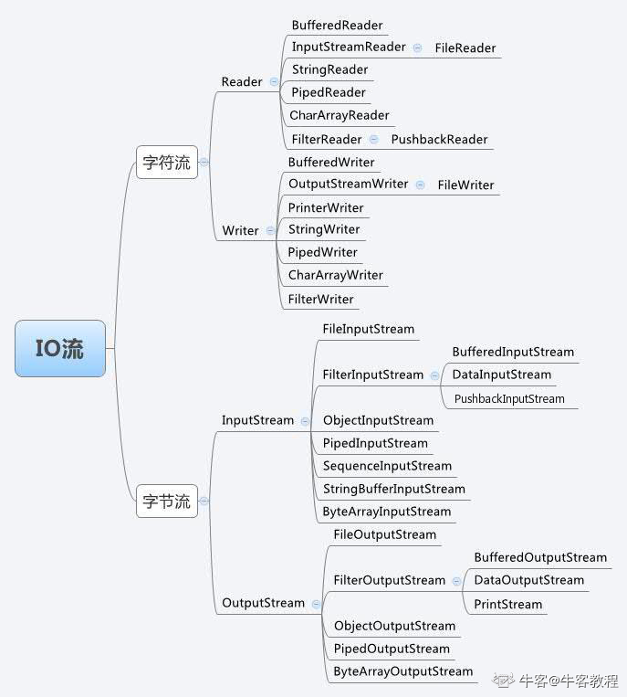

# 标准输入流

```java
InputStream is = System.in;
int by;
while((by == is.read()) != -1) {
	
}
```

```java
// 输入流
InputStreamReader isr = new InputStreamReader(System.in);
// 字节缓存流，建议
BufferedReader in_port = new BufferedReader(new InputStreamReader(System.in));
```

- System.in 静态方法，输入流

- System.out 静态方法，输出流

```java
// 输入int的方法
// 使用Integet.parseInt(String s)
String portNow;
if(!(portNow = in_port.readLine()).equals("q")) {
    Integer Port = Integer.parseInt(portNow);
    System.out.println(Port);
}

```


# 打印流

- 字节打印流

PrintWriter.print()

- 字符打印流

PrintWriter.println()