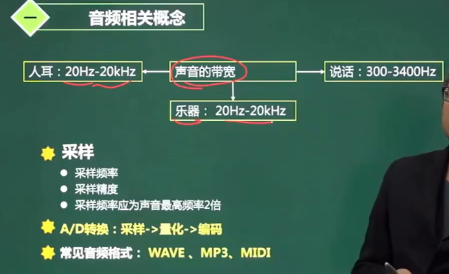
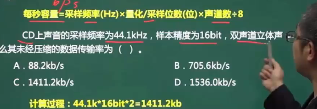
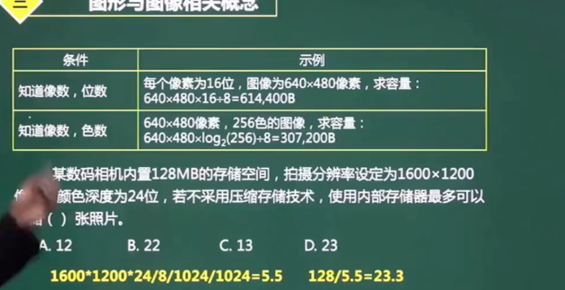
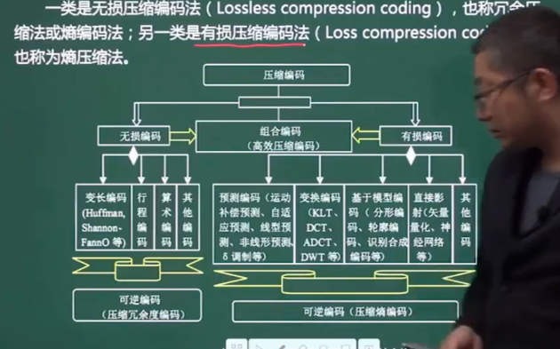
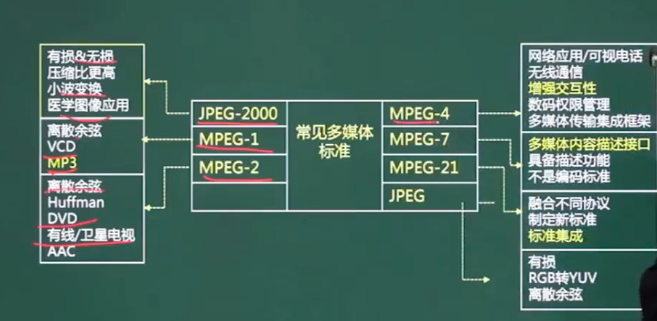

# 多媒体基础知识

 

- 数据传输率 = 频率 X 精度（bit) X 声道​

## 图像

- RGB：色度
- 饱和度：越低越灰

##  图像计算

- 容量 = 像素(位byte)$*$像素位$/$8 B = 像素(位byte)$*$像素位$ bit

- 容量 = $log_2$色数$*$像素位$/$8 B

## 媒体种类

## 数据压缩基础

### 有损压缩和无损压缩

## 常见多媒体标准

