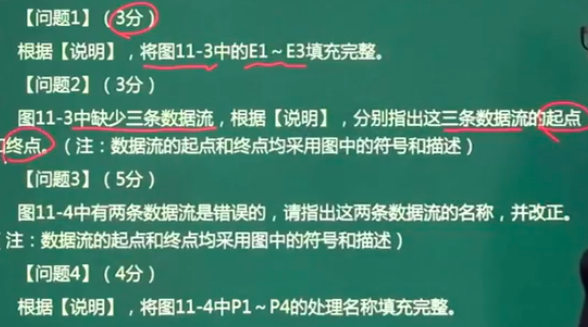

# 数据流图（大题）

## 基本元素

- 例子

- DFD
- 顶层图加工分解->1,2,3
- 平衡情况:每一层与外部实体连接的**数据流方向和数量**一致

## 数据字典

对于数据流图补充说明

eg:

## 数据流图平衡原则

1. 父图和子图

2. 子图内

- (a)和(b)是错误情况。加工却没有相应输入输出
- 或是输入输出不匹配

**eg:**

典型例子，顶层图分解为0层图，观察平衡情况

1. 观察数据流数量和方向

- 前端应用缺失了一个
- 后端数据单操作结果未返回
- 

## 答题技巧

1. 分析流图
2. 确定平衡情况

- 补充实体
- 补充存储
- 补充数据流
- 补充加工名
- 不要创造新名词，只在题中寻找（阅读理解的感觉）
- 先读问题，带着问题看题干

**例题：**

**题解：**

**将可能用到的名词画住**

1. E1:非信用卡客户 E2：信用卡客户 E3：银行。三个外部实体
2. 寻找数据流：1. 看题干  2.和0层对比（一般不行，0层可能也是错的）

- E1->p0：信用卡申请表。E2->p0：激活请求。p0->E2：交易信息。

3. 0层纠错。
4. 加工填空。信用卡申请。信用卡激活。信用卡客户信息管理。信用卡交易信息查询。
5. 答案:

