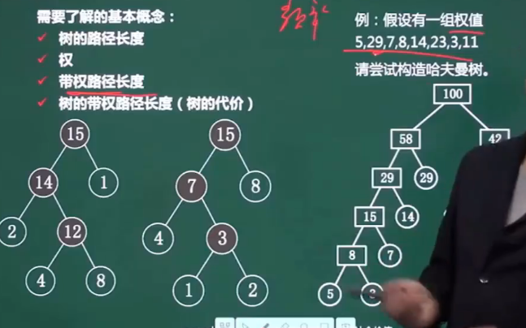
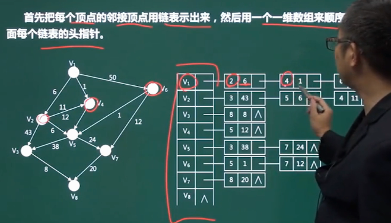

# 数据结构与算法基础

## 数组

- 二维中有按列存储和按行存储
- 按行：先满足一行，再开一列
- 答案：$ a+(2*5+3)*2 $

## 稀疏矩阵

- 计算将稀疏矩阵转为一维矩阵对应的位置

## 线性表

### 顺序存储和链式存储对比

### 队列和栈

## 广义表

## 树与二叉树

### 二叉树遍历

### 树转二叉树

最左子树为左子树，兄弟为右子树

### 查找二叉树

1. 二叉排序树，左孩子小于根，右孩子大于根

### 最优二叉树（哈夫曼树）

构造：从最小的两个开始，然后求和得到新的节点。再寻找最小的两个，循环重复。

- 使值越大的越接近根

### 线索二叉树

### 平衡二叉树

## 图

## 完全图

## 邻接矩阵

## 邻接表

### 图的遍历

### 图的最小生成树

