# 程序设计语言与语言处理程序基础（编译原理)

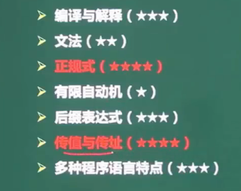

## 编译与解释

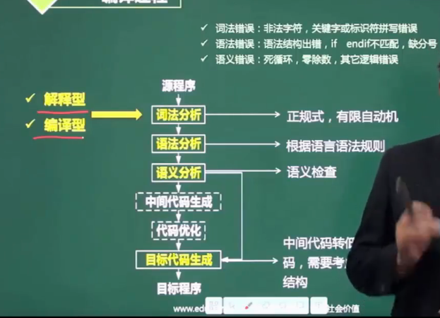

- 解释：HTML/python/Java虚拟机

- 编译：C++

- 词法分析：检查单词是否有错误

- 语法分析：语言语法结构

- 语义分析：静态（编译性错误，没有运行就能检测到）/动态（运行时错误）
- 中间代码生成/代码优化：可能有，可能没有
- 目标代码生成：中间代码转低级语言代码，需要考虑硬件系统结构

## 文法定义

### 分类：

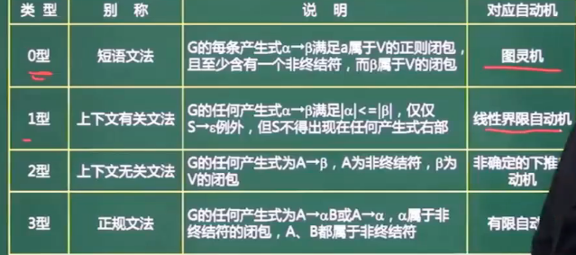

- 有限自动机

## 语法推导树

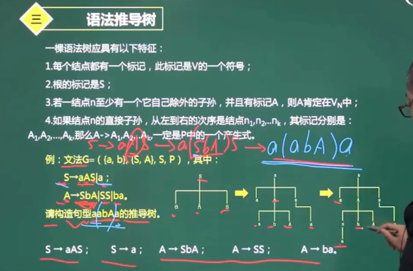

## 有限自动机

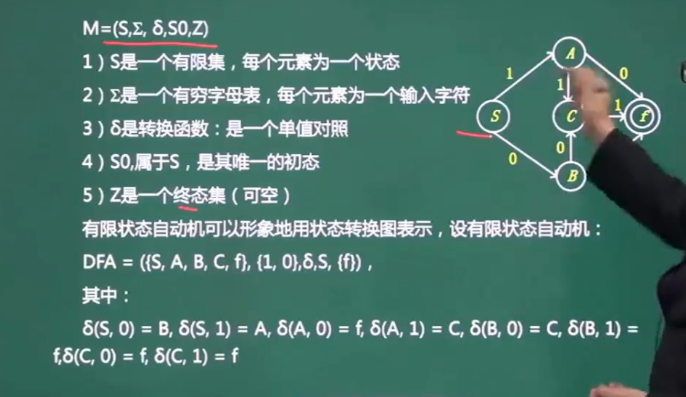

## 正规式

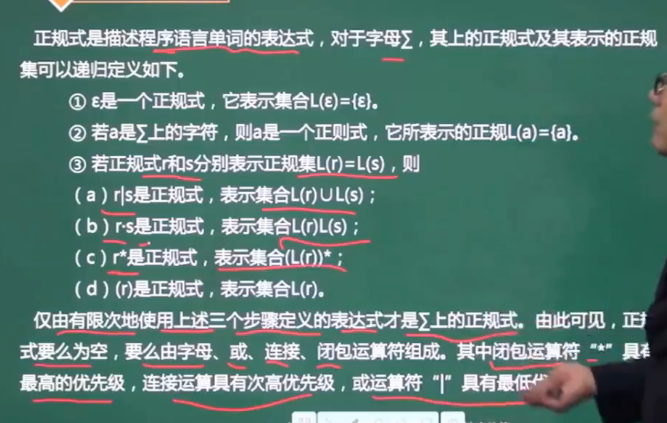

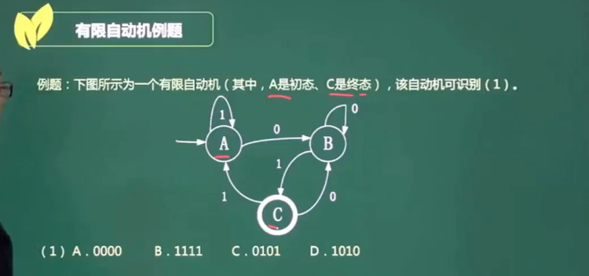

- 初态：->o，进入的时初态
- 终态：加粗的那个

- 最终必须到达终态的才可以
- 正规式：$1^*(01101)^*$

## 数据类型与程序控制结构

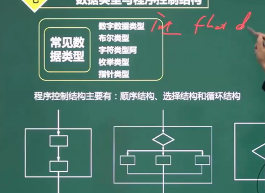

## 表达式

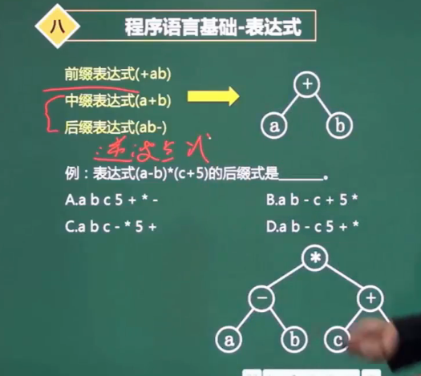

- 中缀-后缀

1. 中缀，画出二叉树；然后后序遍历就得到后缀式。

2. 直接加括号.$((a-b)*(c+5))$.将符号移到被包括的()后面 -》 $ab-c5+*$

## 函数调用-传值和传址

- 函数传入的是地址还是值

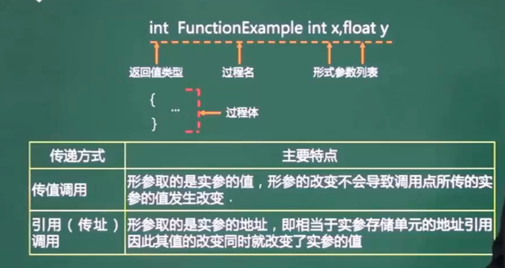

## 各种程序语言特点

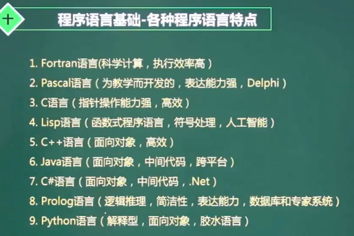